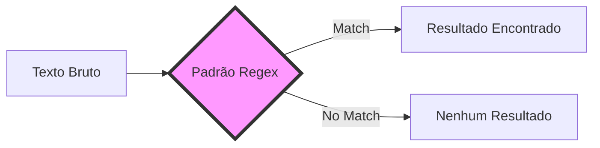

# Aula 01 – Introdução ao Regex 🔍

Bem-vindo à primeira aula do curso de **Expressões Regulares**! Hoje vamos entender o que é esse "superpoder" e por que ele é essencial para qualquer pessoa que trabalhe com tecnologia.

---

## 🧐 O que são Expressões Regulares?

Uma **Expressão Regular** (ou **Regex**) é uma sequência de caracteres que forma um **padrão de busca**. Imagine que você está procurando uma agulha em um palheiro; o Regex é como um detector de metais ultra-sofisticado que te ajuda a encontrar exatamente o que você precisa.

!!! info "Conceito Chave"
    Regex não é uma linguagem de programação, mas sim uma sintaxe poderosa suportada por quase todas as linguagens (JavaScript, Python, Java, PHP, etc.) e ferramentas (VS Code, Excel, Google Sheets).

---

## 🌍 Onde são utilizadas?

O Regex está em todo lugar, mesmo que você não perceba:

1.  **Validação**: Verificar se o que o usuário digitou é realmente um e-mail ou CPF.
2.  **Busca e Substituição**: Trocar todas as datas do formato `DD/MM/AAAA` para `AAAA-MM-DD`.
3.  **Extração**: Retirar apenas os números de telefone de um bloco enorme de texto.
4.  **Web Scraping**: Coletar informações específicas de sites.

---

## 📊 Fluxo de Funcionamento

---

## 💻 Exemplos Práticos no Dia a Dia

Vamos ver como o Regex simplifica tarefas complexas:

$ # Procurando a palavra "erro" em um log
$ grep -E "erro" logs.txt
$
$ # Extraindo apenas números de uma string
$ echo "Pedido #12345" | sed 's/[^0-9]//g'
$ 12345

!!! tip "Dica"
    Regex pode parecer assustador no começo devido à sua sintaxe "estranha", mas com prática, você verá que é uma ferramenta de produtividade incomparável.

---

## 🛠️ Ferramenta Indispensável: Regex101

Para testar suas expressões online sem precisar configurar nada, utilizaremos o [Regex101](https://regex101.com/).

### Como usar:
1.  Selecione a linguagem (Flavor) no menu lateral (ex: JavaScript ou Python).
2.  Digite sua **Expressão Regular** no campo superior.
3.  Digite o **Texto de Teste** no campo central.
4.  Veja a mágica acontecer e a explicação detalhada no painel direito!

---

## 📝 Exercícios de Aquecimento

1.  **Básico**: No Regex101, digite o texto "Olá Mundo" e tente encontrar a palavra "Mundo" usando Regex literal.
2.  **Básico**: Qual a diferença entre pesquisar "Log" e "log" em um texto? (Dica: Pense em Maiúsculas/Minúsculas).
3.  **Intermediário**: Tente encontrar o número "2024" no texto "O ano atual é 2024".
4.  **Intermediário**: Como você buscaria a palavra "Regex" usando apenas metacaracteres se já soubesse que ela tem 5 letras? (Veremos isso na Aula 03, mas tente adivinhar!).
5.  **Desafio**: No Regex101, cole um parágrafo qualquer e tente destacar todas as letras "a" (minúsculas).

---

## 🚀 Mini-Projeto: O Primeiro Match

**Objetivo**: Validar manualmente uma palavra em uma frase.

1.  Abra o [Regex101](https://regex101.com/).
2.  Crie um padrão para encontrar seu próprio nome em um texto que descreve quem você é.
3.  Ative a flag `i` (Ignore Case) e veja se o nome continua sendo encontrado mesmo se você mudar a caixa das letras.