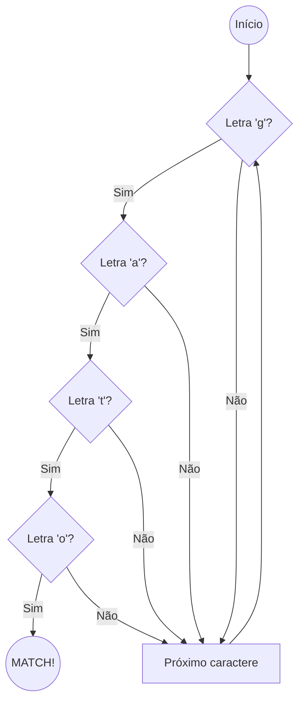

# Aula 02 – Estrutura Básica de uma Expressão Regular 🏗️

Nesta aula, vamos mergulhar na fundação do Regex: a busca por textos fixos e como as máquinas interpretam as letras.

---

## 🔡 Texto Literal

A forma mais simples de Regex é o **texto literal**. Se você digitar `gato` no seu buscador Regex, ele encontrará exatamente a sequência de letras "g", "a", "t", "o", nessa ordem.

!!! warning "Atenção"
    O Regex procura por padrões exatos. Se você buscar por `gato`, as palavras `Gato` ou `GATO` não serão encontradas por padrão, pois a busca é sensível a maiúsculas e minúsculas.

---

## 🔠 Sensibilidade (Case Sensitivity)

Por padrão, a maioria dos motores de Regex diferencia `A` de `a`. 

- **Padrão**: `casa`
- **Texto**: "A **casa** é verde." ✅ (Match)
- **Texto**: "Minha **Casa**, minha vida." ❌ (No Match)

!!! tip "Dica"
    Para ignorar essa diferença, usamos a flag `i` (Ignore Case). Com ela, `casa` encontraria `CASA`, `cAsA`, etc.

---

## 📊 Diagrama de Fluxo de Busca Literal



---

## 💻 Primeiros Testes Práticos em Terminal

Podemos usar o Regex até no seu computador para filtrar arquivos ou textos.

<div class="termy">
$ # Filtrando nomes que começam com "A" (case-sensitive)
$ echo "Ana\nana\nArthur" | grep "A"
$ Ana
$ Arthur
$
$ # Filtrando nomes ignorando maiúsculas/minúsculas
$ echo "Ana\nana\nArthur" | grep -i "ana"
$ Ana
$ ana
</div>

---

## 📝 Exercícios de Fixação

1.  **Básico**: Crie uma expressão para encontrar a palavra "Python" em um parágrafo. Funciona se o texto estiver escrito "python"?
2.  **Básico**: No Regex101, use o texto "O rato roeu a roupa do rei". Tente dar match na palavra "rato".
3.  **Intermediário**: Tente encontrar a palavra "programação" (com acento). O Regex literal exige o acento?
4.  **Intermediário**: Como você buscaria o número "123" usando texto literal?
5.  **Desafio**: No Regex101, experimente ativar e desativar a flag `i` no canto superior direito e observe o que muda ao buscar por seu próprio nome.

---

## 🚀 Mini-Projeto: Localizador de Erros

**Objetivo**: Encontrar mensagens de erro em um log simulado.

1.  Cole o seguinte texto no Regex101:
    ```text
    SYSTEM_INFO: Starting...
    SYSTEM_WARNING: Low memory.
    SYSTEM_ERROR: Database connection failed.
    system_error: Disk full.
    ```
2.  Crie um Regex literal para encontrar apenas `SYSTEM_ERROR`.
3.  Agora, use a flag `i` para encontrar as duas ocorrências de erro (tanto maiúscula quanto minúscula).