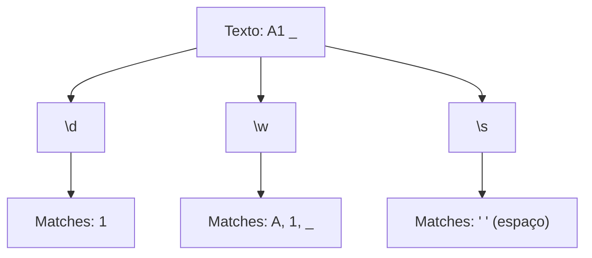

# Aula 03 – Metacaracteres Fundamentais 🔣

Bem-vindo ao coração do Regex! Metacaracteres são símbolos especiais que não representam a si mesmos, mas sim conceitos como "qualquer número" ou "qualquer letra".

---

## ⏺️ O Ponto (`.`) - O Coringa

O ponto é o metacaractere mais versátil. Ele dá match em **qualquer caractere único**, exceto quebras de linha.

- **Padrão**: `c.sa`
- **Match**: `casa`, `cosa`, `c1sa`, `c#sa`.

!!! info "Conceito"
    O `.` é como uma peça de Lego que se encaixa em qualquer buraco de um único caractere.

---

## 🔢 Atalhos de Classes (`\d`, `\w`, `\s`)

Existem atalhos para grupos comuns que facilitam muito a nossa vida:

| Metacaractere | O que significa | Exemplo |
| :--- | :--- | :--- |
| `\d` | **D**igit (Qualquer número de 0 a 9) | `9`, `5` |
| `\w` | **W**ord (Letras, números e underline `_`) | `a`, `B`, `7`, `_` |
| `\s` | **S**pace (Espaços, tabs e quebras de linha) | ` `, `\t` |

!!! tip "Dica"
    Se você usar a letra maiúscula (`\D`, `\W`, `\S`), você está fazendo a **negação**. Por exemplo, `\D` significa "qualquer coisa que NÃO seja um número".

---

## 📊 Tabela de Correspondências

---

## 🛡️ O Caractere de Escape (`\`)

E se você quiser procurar por um ponto real (como em um endereço de IP)? Como o `.` é um metacaractere, você precisa "desativar" o poder dele usando a barra invertida `\`.

- **Padrão**: `google.com` (Errado: o ponto encontrará qualquer coisa)
- **Padrão**: `google\.com` (Certo: encontra exatamente o ponto final)

---

## 💻 Exemplo em TermynalJS

$ # Buscando padrões com dígitos (\d)
$ grep -P "\d\d/\d\d" datas.txt
$ 10/05
$ 25/12
$
$ # Buscando por um ponto literal
$ grep -P "v1\.0" versoes.txt
$ v1.0.1

---

## 📝 Exercícios de Fixação

1.  **Básico**: Crie um Regex para encontrar datas no formato `00/00` usando `\d`.
2.  **Básico**: Use o `.` para encontrar as palavras `cola`, `cela` e `cila` com um único padrão.
3.  **Intermediário**: Como você buscaria um nome de usuário que tem 3 letras seguidas de um underline? (Ex: `abc_`).
4.  **Intermediário**: Tente dar match em um valor monetário simples como `$ 5` usando `\$ \s \d`.
5.  **Desafio**: No Regex101, tente encontrar todas as palavras em um texto que possuam exatamente 4 letras usando `\w\w\w\w`.

---

## 🚀 Mini-Projeto: Extrator de Versões

**Objetivo**: Identificar versões de software em um texto.

1.  Texto: `A versão estável é v1.4, mas testamos a v1.a e a v2.0.`
2.  Crie um Regex que capture apenas as versões válidas (v + número + ponto + número).
3.  Dica: Use `v\d\.\d`.