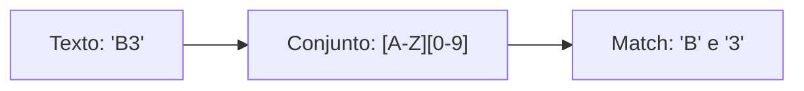

# Aula 04 – Conjuntos de Caracteres 📦

E se você quiser encontrar uma vogal, mas não souber qual? Ou apenas letras minúsculas? É aqui que entram os **Conjuntos de Caracteres**.

---

## 🔡 O que são Conjuntos?

Um conjunto é definido entre colchetes `[]`. Ele diz ao Regex: "Dê match em **qualquer um** dos caracteres que estão aqui dentro".

- **Padrão**: `[aeiou]`
- **Texto**: "bola" -> Encontra `o`, depois `a`.

---

## 📏 Usando Intervalos (Ranges)

Em vez de digitar todos os números ou letras, podemos usar o hífen `-` para definir um intervalo.

| Conjunto | Descrição |
| :--- | :--- |
| `[a-z]` | Qualquer letra **minúscula** de 'a' até 'z'. |
| `[A-Z]` | Qualquer letra **maiúscula** de 'A' até 'Z'. |
| `[0-9]` | Qualquer número de 0 a 9 (o mesmo que `\d`). |
| `[a-zA-Z]` | Qualquer letra, independente da caixa. |

!!! info "Flexibilidade"
    Você pode combinar tudo: `[a-f0-3]` encontrará as letras de 'a' a 'f' e os números de 0 a 3.

---

## 📊 Visualização de Conjuntos

---

## 🚫 Negação (`[^...]`)

Se você colocar um circunflexo `^` logo após o primeiro colchete, o conjunto se torna uma **negação**. Ele encontrará qualquer coisa que **NÃO** esteja na lista.

- **Padrão**: `[^0-9]`
- **Significado**: Qualquer caractere que NÃO seja um número.

!!! warning "Atenção"
    O `^` só tem poder de negação se for o **primeiro** caractere dentro dos colchetes. Se estiver fora, ele tem outra função (veremos na Aula 06).

---

## 💻 Exemplo em TermynalJS

$ # Buscando apenas vogais
$ echo "software" | grep -o "[aeiou]"
$ o
$ a
$ e
$
$ # Buscando tudo que NÃO é letra minúscula
$ echo "RegEx 101" | grep -o "[^a-z]"
$ R
$ E
$  
$ 1
$ 0
$ 1

---

## 📝 Exercícios de Fixação

1.  **Básico**: Crie um Regex que encontre apenas as letras 'x', 'y' ou 'z'.
2.  **Básico**: Use um intervalo para encontrar qualquer letra entre 'm' e 'q'.
3.  **Intermediário**: Crie um padrão que localize todas as consoantes minúsculas (Dica: Pense em negação de vogais ou lista completa).
4.  **Intermediário**: Como você buscaria um caractere que seja uma letra maiúscula ou um dígito?
5.  **Desafio**: No Regex101, tente criar um padrão que encontre um código de 3 caracteres onde o primeiro é uma letra maiúscula, o segundo é um número e o terceiro é uma letra minúscula.

---

## 🚀 Mini-Projeto: Filtro de Placas (Básico)

**Objetivo**: Identificar o início de uma placa de carro antiga (3 letras).

1.  Texto: `ABC-1234, xyz-9999, DEF-0000`.
2.  Crie um Regex que pegue apenas os conjuntos de 3 letras maiúsculas.
3.  Dica: Use `[A-Z][A-Z][A-Z]`.