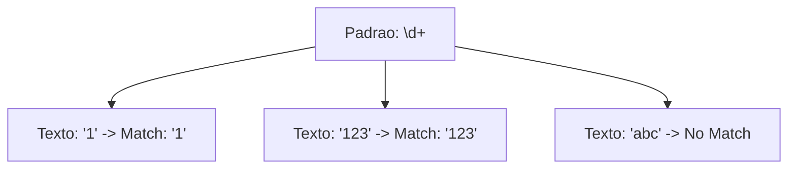

# Aula 05 – Quantificadores 🔢

Até agora, cada símbolo que escrevemos representava exatamente uma posição no texto. Com os **Quantificadores**, podemos dizer: "Encontre este padrão várias vezes seguidas".

---

## ➕ Os Quantificadores Básicos

Eles são colocados logo após o caractere ou conjunto que você quer repetir.

| Símbolo | Significado | Exemplo (`a...`) |
| :--- | :--- | :--- |
| `*` | **Zero ou mais** vezes. | `a*` encontra "", "a", "aaaa" |
| `+` | **Uma ou mais** vezes. | `a+` encontra "a", "aaaa" (mínimo 1) |
| `?` | **Opcional** (Zero ou uma vez). | `a?` encontra "" ou "a" |

---

## 🎯 Quantidade Exata `{n,m}`

Se você precisa de um controle mais fino, usamos as chaves.

- `{n}`: Exatamente `n` vezes. (Ex: `\d{3}` para 3 dígitos).
- `{n,}`: No mínimo `n` vezes. (Ex: `\w{5,}` para palavras longas).
- `{n,m}`: Entre `n` e `m` vezes. (Ex: `\d{2,4}` para anos com 2 ou 4 dígitos).

---

## 📊 Funcionamento Visual

---

## 🧠 Guloso vs. Preguiçoso (Greedy vs Lazy)

Por padrão, os quantificadores são **gulosos**: eles tentam pegar o máximo de texto possível.

- **Texto**: `"capítulo 1" e "capítulo 2"`
- **Padrão**: `".*"` -> Pegará desde a primeira aspa até a **última**.
- **Padrão Preguiçoso**: `".*?"` -> Pegará apenas o primeiro conteúdo entre aspas.

!!! tip "Dica"
    Adicione o `?` após um quantificador (como `+?` ou `*?`) para torná-lo preguiçoso.

---

## 💻 Exemplo em TermynalJS

$ # Buscando palavras com 5 a 8 letras
$ grep -E "\b\w{5,8}\b" texto.txt
$ Brasil
$ Programas
$
$ # Validando um ano (4 dígitos)
$ echo "2024" | grep -P "^\d{4}$"
$ 2024

---

## 📝 Exercícios de Fixação

1.  **Básico**: Crie um Regex que encontre a palavra "casa" seguida de um ou mais espaços.
2.  **Básico**: Use o `?` para encontrar tanto "cor" quanto "color" (em inglês, *color* vs *colour*).
3.  **Intermediário**: Crie um padrão para validar um número de telefone simples com 8 ou 9 dígitos (ex: `988887777`).
4.  **Intermediário**: Use `\d{1,3}` para encontrar todos os números entre 1 e 999 em um texto.
5.  **Desafio**: No Regex101, tente capturar tudo o que está dentro de uma tag HTML `
...
` de forma que ele pare no primeiro fechamento de tag (preguiçoso).

---

## 🚀 Mini-Projeto: Validador de Usuário

**Objetivo**: Validar um nome de usuário que deve:
- Começar com uma letra.
- Ter entre 5 e 12 caracteres alfanuméricos.

1.  Dica: Use `[a-zA-Z]\w{4,11}`.
2.  Por que `{4,11}`? Porque a primeira letra já conta como 1 caractere!
3.  Teste com: `admin`, `user123`, `a`, `meu_usuario_muito_longo`.