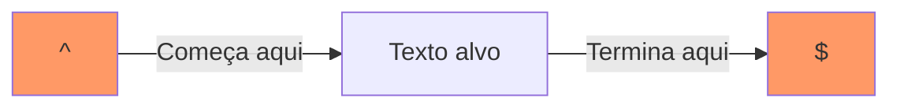

# Aula 06 – Âncoras ⚓

Até agora, nossos padrões encontravam correspondências em qualquer lugar do texto. As **Âncoras** servem para fixar a busca em uma posição específica: o início ou o fim do texto/linha.

---

## 🔝 Início da Linha (`^`)

O símbolo `^` (circunflexo), quando usado fora de colchetes, indica que o padrão deve começar exatamente no **início da linha**.

- **Texto**: `Engenharia de Software`
- **Padrão**: `^Engenharia` -> ✅ Match
- **Padrão**: `^Software` -> ❌ No Match (pois 'Software' não está no início)

---

## 🔚 Fim da Linha (`$`)

O símbolo `$` (cifrão) indica que o padrão deve estar exatamente no **fim da linha**.

- **Texto**: `projeto.js`
- **Padrão**: `js$` -> ✅ Match
- **Padrão**: `projeto$` -> ❌ No Match

---

## 🛡️ Validação Completa de Campos

Este é o uso mais importante das âncoras. Ao combinar `^` no início e `$` no fim, você garante que o texto inteiro obedeça à regra, sem "lixo" antes ou depois.

| Padrão | O que aceita | Exemplo "2024" |
| :--- | :--- | :--- |
| `\d{4}` | Qualquer lugar | `"Em 2024..."` ✅ |
| `^\d{4}$` | Apenas o número | `"2024"` ✅ |
| `^\d{4}$` | Texto misto | `"Ano 2024"` ❌ |

---

## 📊 Visualização de Âncoras



---

## 💻 Exemplo em TermynalJS

<div class="termy">
$ # Listando apenas arquivos que terminam em .md
$ ls | grep -P "\.md$"
$ README.md
$ aula-01.md
$
$ # Validando se uma linha contém APENAS números
$ echo "12345" | grep -P "^\d+$"
$ 12345
$
$ echo "123a45" | grep -P "^\d+$"
$ # (Sem saída, pois contém uma letra)
</div>

---

## 📝 Exercícios de Fixação

1.  **Básico**: Crie um Regex que verifique se uma frase começa com a palavra "Bem-vindo".
2.  **Básico**: Crie um Regex que localize arquivos que terminam com a extensão `.pdf`.
3.  **Intermediário**: Tente validar uma linha que deve conter exatamente 5 dígitos, sem nada antes ou depois.
4.  **Intermediário**: Como você buscaria uma linha que começa com um número e termina com um ponto final?
5.  **Desafio**: No Regex101, use o texto:
    ```text
    linha 1
    outra linha
    última linha
    ```
    Ative a flag `m` (multiline) e tente encontrar todas as linhas que terminam com a palavra `linha`.

---

## 🚀 Mini-Projeto: Validador de ID

**Objetivo**: Validar um código de produto que deve ter exatamente:
- 2 letras maiúsculas no início.
- Seguidas por um hífen `-`.
- Terminadas por 4 números.

1.  Dica: Use `^[A-Z]{2}-\d{4}$`.
2.  Teste com: `AB-1234` (✅), `abc-1234` (❌), `AB-123` (❌), `Z-9999` (❌).