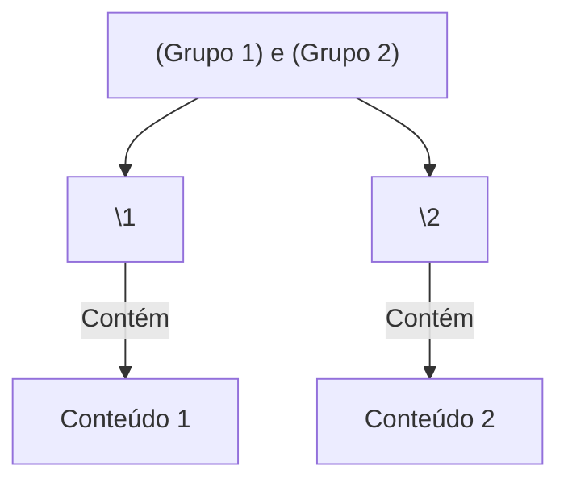

# Aula 07 – Agrupamentos e Captura 🎯

As vezes não queremos apenas encontrar um texto, mas sim **isolar** uma parte dele para usar mais tarde. É aqui que os parênteses `()` entram em cena.

---

## 📦 Grupos de Captura `()`

Ao envolver parte do seu Regex em parênteses, você cria um **grupo**. Isso permite:
1.  Aplicar quantificadores a um grupo inteiro.
2.  Extrair aquela parte específica do texto.

- **Padrão**: `(abc)+` -> Encontra "abc", "abcabc", "abcabcabc".
- **Sem parênteses**: `abc+` -> Encontra "abccccccc" (apenas o 'c' repete).

---

## 🔢 Referências Internas (Backreferences)

O motor de Regex "lembra" o que foi capturado em cada parênteses. Você pode usar `\1`, `\2`, etc., para repetir o que foi encontrado no primeiro ou segundo grupo.

- **Padrão**: `<(\w+)>.*?</\1>`
- **Exemplo**: Ele garante que se abriu uma tag `<b>`, ela deve fechar com `</b>`, e não com `</i>`.

!!! info "Numeração"
    Os grupos são numerados pela ordem em que os parênteses **abrem**. O grupo 0 é sempre o match completo.

---

## 📊 Estrutura de Grupos

---

## 💻 Exemplo em TermynalJS (Substituição)

No terminal ou editores, podemos usar grupos para trocar a ordem das coisas.

$ # Trocando Nome e Sobrenome (Ricardo Pires -> Pires, Ricardo)
$ echo "Ricardo Pires" | sed -r 's/(\w+) (\w+)/\2, \1/'
$ Pires, Ricardo

---

## 📝 Exercícios de Fixação

1.  **Básico**: Crie um Regex que capture o código de área e o número de um telefone separadamente: `(11) 9999-8888`.
2.  **Básico**: Use parênteses para repetir a palavra "Erro" 3 vezes: `ErroErroErro`.
3.  **Intermediário**: No Regex101, use um texto com datas `21/10/2024` e capture o dia, o mês e o ano em 3 grupos diferentes.
4.  **Intermediário**: Como você buscaria uma palavra que se repete duas vezes seguidas separada por espaço? (Ex: `tchau tchau`). Dica: use `\1`.
5.  **Desafio**: Crie um padrão que extraia apenas o nome de usuário de um e-mail `contato@empresa.com` (tudo o que vem antes do `@`).

---

## 🚀 Mini-Projeto: Extrator de Preços

**Objetivo**: Extrair a moeda e o valor separadamente de uma lista de produtos.

1.  Texto: `Cadeira: R$ 150, Mesa: US$ 300, Sofá: € 500`.
2.  Regex: `([A-Z\$]+)\s?(\d+)`.
3.  No Regex101, observe no painel lateral como ele separa os "Capture Groups" para cada item encontrado.
4.  Dessa forma, um sistema poderia converter os valores automaticamente consultando o grupo 1 (moeda)!