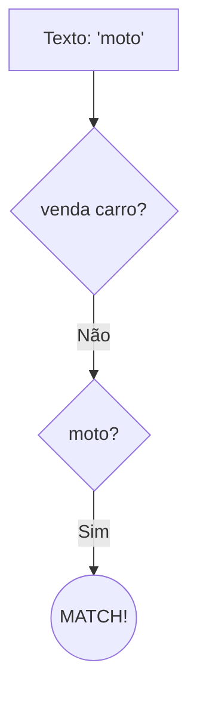

# Aula 08 – Alternância 🔀

E se você precisar encontrar "cachorro" OU "gato"? O operador de **Alternância** `|` (pipe) é o "OU" do Regex.

---

## 🏗️ O Operador `|`

A alternância permite que você defina várias opções de match. Ela verifica se o texto corresponde à opção da esquerda **ou** da direita.

- **Padrão**: `cachorro|gato`
- **Match**: Encontra tanto "cachorro" quanto "gato".

!!! info "Prioridade"
    O Regex tenta o match da esquerda para a direita. No padrão `ab|abc`, se o texto for "abc", ele pode dar match em "ab" e parar (dependendo do motor), por isso é boa prática colocar o padrão mais longo primeiro: `abc|ab`.

---

## 📦 Alternância com Agrupamento

Geralmente usamos a alternância dentro de parênteses para limitar o "poder" do OU.

- **Padrão**: `venda (carro|moto)`
- **Match**: `venda carro`, `venda moto`.
- **Sem parênteses**: `venda carro|moto` -> Encontraria `venda carro` OU apenas `moto`.

---

## 📊 Árvore de Decisão

---

## 💻 Exemplo em TermynalJS

$ # Buscando por extensões de imagem variadas
$ ls | grep -Ei "\.(jpg|png|gif|webp)$"
$ logo.png
$ foto.jpg
$ loader.gif

---

## 📝 Exercícios de Fixação

1.  **Básico**: Crie um Regex que encontre as cores "verde", "amarelo" ou "azul".
2.  **Básico**: Use a alternância para encontrar os nomes "João" ou "Maria".
3.  **Intermediário**: Crie um padrão que localize arquivos com extensões `.pdf` ou `.docx`.
4.  **Intermediário**: Como você buscaria as saudações "Bom dia", "Boa tarde" ou "Boa noite" usando agrupamento? Dica: `Bo(m dia|a tarde|a noite)`.
5.  **Desafio**: No Regex101, crie um padrão que valide se uma palavra é "SIM", "S", "NAO" ou "N" (use a flag `i`).

---

## 🚀 Mini-Projeto: Filtro de Protocolos

**Objetivo**: Identificar se uma URL utiliza protocolos seguros ou comuns.

1.  Texto: `http://site.com, https://seguro.org, ftp://files.net, ssh://server`.
2.  Regex: `(http|https|ftp|ssh)://`.
3.  No Regex101, veja como ele destaca apenas o protocolo inicial.
4.  Extra: Tente simplificar `http|https` para `https?`.