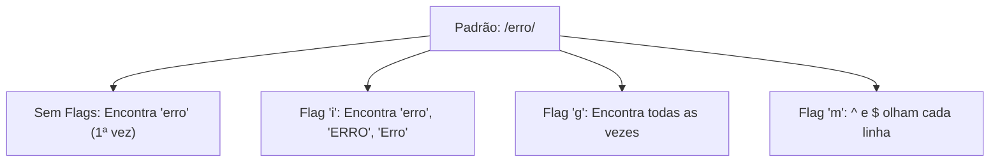

# Aula 09 – Modificadores (Flags) 🚩

Até agora, aprendemos a sintaxe estrutural. As **Flags** (ou Modificadores) são configurações globais que mudam o *comportamento* de como o motor de Regex processa o texto.

---

## 🏳️ As Flags Mais Comuns

Elas geralmente são colocadas após a barra final de um Regex: `/padrão/flags`.

| Flag | Nome | Descrição |
| :--- | :--- | :--- |
| **i** | **Ignore Case** | Ignora a diferença entre Maiúsculas e Minúsculas. |
| **g** | **Global** | Encontra **todas** as ocorrências, não apenas a primeira. |
| **m** | **Multiline** | Faz as âncoras `^` e `$` funcionarem para cada linha. |
| **s** | **Dot All** | Faz o ponto `.` dar match também em quebras de linha (`\n`). |

---

## 🔄 Global (`g`) vs Single Match

Sem a flag global, o Regex para assim que encontra o primeiro resultado.

- **Texto**: `casa, casa, casa`
- **Padrão `/casa/`**: Encontra apenas a primeira "casa".
- **Padrão `/casa/g`**: Encontra as três instâncias.

---

## 📊 Resumo Visual das Flags



---

## 💻 Exemplo em TermynalJS

Em comandos de terminal, as flags costumam ser opções (como `-i` para ignore case).

<div class="termy">
$ # Buscando por "admin" ignorando caixa
$ grep -i "admin" usuarios.txt
$ Admin
$ ADMIN
$ admin_01
</div>

---

## 📝 Exercícios de Fixação

1.  **Básico**: No Regex101, busque por "regex" em um parágrafo e ative a flag `g`. Observe os múltiplos destaques.
2.  **Básico**: Ative a flag `i` e tente dar match em "TEXTO" usando o padrão `texto`.
3.  **Intermediário**: Use a flag `m` para encontrar o início de cada linha em um texto com vários parágrafos.
4.  **Intermediário**: Qual flag você usaria para garantir que o ponto `.` capture todo o conteúdo de um arquivo HTML, incluindo as quebras de linha?
5.  **Desafio**: No Regex101, experimente combinar flags: `/padrao/gi`. O que isso faz?

---

## 🚀 Mini-Projeto: Limpador de Logs

**Objetivo**: Destacar todas as linhas que contenham erros, independente da caixa.

1.  Texto:
    ```text
    10:00 - info: system ok
    10:01 - ERROR: connection lost
    10:05 - Error: timeout
    10:10 - info: retrying
    ```
2.  Regex: `^.*error.*$`
3.  Flags necessárias: `g` (para pegar todos), `i` (para pegar as variações de 'error') e `m` (para o `^` e `$` olharem cada linha).