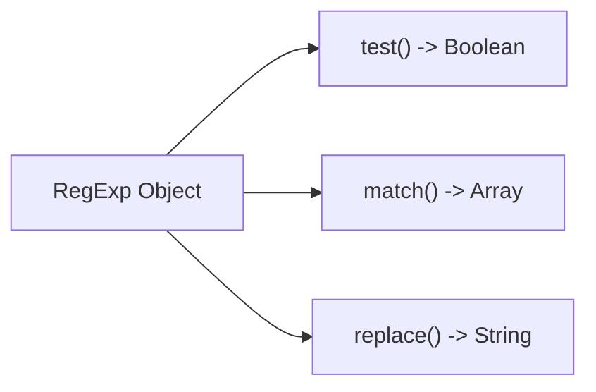

# Aula 10 – Regex na Prática com JavaScript 📜

Agora que você já conhece a teoria, vamos aplicá-la em código real! O JavaScript possui um suporte excelente para Regex, utilizando o objeto `RegExp` ou a sintaxe de barras `/padrao/`.

---

## 🛠️ Três Métodos Essenciais

Em JavaScript, usamos Regex principalmente de três formas:

### 1. `regex.test(string)`
Retorna um booleano (`true` ou `false`). Ideal para **validação**.

```javascript
const regexEmail = /^[a-z]+@gmail\.com$/;
console.log(regexEmail.test("contato@gmail.com")); // true
```

### 2. `string.match(regex)`
Retorna um **array** com as correspondências encontradas. Ótimo para **extração**.

```javascript
const texto = "Match 1 e Match 2";
const encontrados = texto.match(/\d/g);
console.log(encontrados); // ["1", "2"]
```

### 3. `string.replace(regex, novoTexto)`
Substitui o que foi encontrado por um novo texto. Perfeito para **limpeza e transformação**.

```javascript
const fone = "9999-8888";
const limpo = fone.replace("-", ""); // "99998888"
```

---

## 📊 Fluxo no JavaScript



---

## 💻 Exemplo em TermynalJS (Node.js)

<div class="termy">
$ # Testando via Node.js
$ node -e "console.log(/\d+/.test('Aula 10'))"
$ true
$
$ # Extraindo anos de uma frase
$ node -e "console.log('2023 e 2024'.match(/\d+/g))"
$ [ '2023', '2024' ]
</div>

---

## 📝 Exercícios de Fixação

1.  **Básico**: Crie uma variável que contenha um Regex para validar se uma string é composta apenas por letras minúsculas: `const regex = /.../`.
2.  **Básico**: Use o método `.test()` para verificar se a palavra "sucesso" está contida na frase "O curso é um sucesso!".
3.  **Intermediário**: Dado o texto `contato: 11-9999-8888`, use `.match()` com a flag `g` para extrair todos os números.
4.  **Intermediário**: Use `.replace()` para trocar todos os espaços de uma frase por sublinhados (`_`).
5.  **Desafio**: Crie uma função que receba uma senha e use `.test()` para garantir que ela tenha pelo menos um número e pelo menos 6 caracteres.

---

## 🚀 Mini-Projeto: Validador de Formulário (JS)

**Objetivo**: Criar um script que valide um campo de nome de usuário.

1.  Regra: O nome deve ter entre 3 e 15 letras, sem números.
2.  Código:
    ```javascript
    const username = "ricardo_pires";
    const validador = /^[a-zA-Z]{3,15}$/;
    
    if (validador.test(username)) {
        console.log("✅ Usuário Válido!");
    } else {
        console.log("❌ Usuário Inválido! Use apenas letras (3-15).");
    }
    ```
3.  Teste mudando o valor da variável `username`.