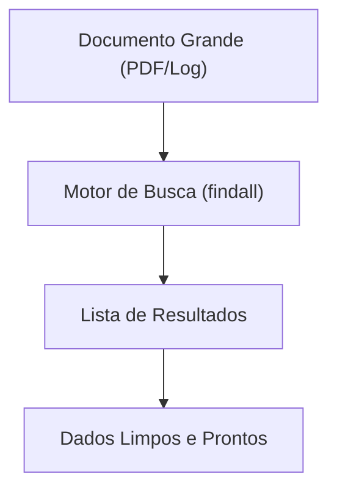

# Aula 13 – Extração de Dados ⛏️

Buscar padrões é útil, mas **extrair** informações específicas de uma massa de texto é onde o Regex economiza horas de trabalho manual.

---

## 📅 Extraindo Datas

Imagine um log de sistema com milhares de linhas. Como extrair apenas as datas das ocorrências?

- **Texto**: `O sistema falhou em 21/10/2024 e novamente em 23/10/2024.`
- **Regex**: `\d{2}/\d{2}/\d{4}`
- **Resultado**: `["21/10/2024", "23/10/2024"]`

---

## 🏷️ Extraindo Hashtags e Menções

Muito comum em análise de redes sociais.

- **Hashtags**: `#[a-zA-Z\d_]+`
- **Menções (@)**: `@[a-zA-Z\d_]+`

---

## 🔗 Extraindo Links de HTML

Extrair o atributo `src` de imagens ou `href` de links.

- **Regex para Links**: `href="([^"]+)"`
- **Explicação**: Captura tudo o que está dentro das aspas do `href`.

---

## 📊 Fluxo de Extração



---

## 💻 Exemplo em TermynalJS (grep -o)

A flag `-o` do `grep` é excelente para extração, pois ela retorna apenas a parte que deu match, e não a linha inteira.

<div class="termy">
$ # Extraindo apenas as hashtags de um post
$ echo "Aprendendo #Regex com #Python e #JS" | grep -oP "#\w+"
$ #Regex
$ #Python
$ #JS
</div>

---

## 📝 Exercícios de Fixação

1.  **Básico**: Crie um Regex para extrair todos os valores monetários de uma lista: `R$ 10, R$ 50, R$ 100`.
2.  **Básico**: Extraia todas as palavras que possuem exatamente 3 letras de um parágrafo.
3.  **Intermediário**: Dado um texto com vários nomes de usuários no formato `@usuario`, extraia apenas o nome (sem o @) usando grupos de captura.
4.  **Intermediário**: Extraia todos os números de telefone de uma página de contatos.
5.  **Desafio**: No Regex101, tente extrair o conteúdo de dentro de todos os títulos `<h1>...</h1>` de um código HTML simulado.

---

## 🚀 Mini-Projeto: Analisador de Logs

**Objetivo**: Extrair os IPs e os horários de acesso de um log de servidor.

1.  Texto de Exemplo:
    ```text
    192.168.0.1 - [10:30:05] - GET /index.html
    10.0.0.5 - [10:32:10] - POST /login
    ```
2.  Regex para IP: `\d{1,3}(\.\d{1,3}){3}`
3.  Regex para Hora: `\[(\d{2}:\d{2}:\d{2})\]`
4.  Crie um script (JS ou Python) que percorra essas linhas e imprima: "O IP X acessou o sistema às Y horas".