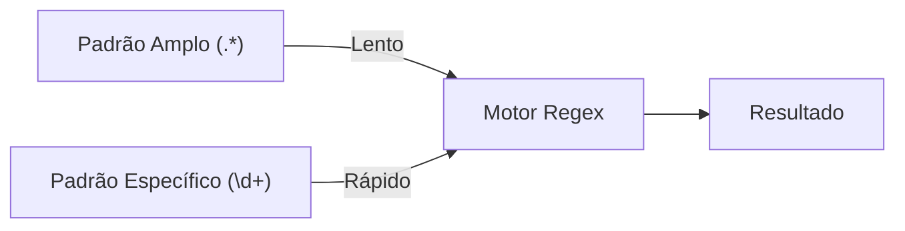

# Aula 15 – Desempenho e Boas Práticas ⚡

Nem tudo que funciona é eficiente. Um Regex mal escrito pode travar um servidor ou tornar uma aplicação lenta. Vamos aprender a escrever padrões profissionais.

---

## 🐢 O Perigo do Backtracking

Backtracking acontece quando o motor de Regex tenta várias combinações e falha, precisando "voltar" e tentar de novo. Casos extremos levam ao **Catastrophic Backtracking**.

- **Exemplo Ruim**: `(a+)+b`
- Se você testar isso em uma string com muitos 'a's e nenhum 'b', o computador fará bilhões de cálculos inúteis.

!!! warning "Cuidado"
    Evite aninhar quantificadores (como `(a*)*`).

---

## 🚀 Dicas de Performance

1.  **Seja Específico**: Em vez de `.*` (que pega tudo), use `[a-z]+` se você sabe que só haverá letras.
2.  **Use Âncoras**: `^` e `$` ajudam o motor a falhar rápido se o padrão já não bater no início/fim.
3.  **Grupos de Não-Captura**: Se você não precisa extrair o dado, use `(?:...)` em vez de `(...)`. Isso economiza memória.
4.  **Falhe Cedo**: Coloque os padrões mais comuns primeiro na alternância `|`.

---

## 🎓 Boas Práticas de Legibilidade

Regex pode ser ilegível. Ajude seus colegas (e seu eu do futuro):

- **Comente**: Documente o que aquele "hieroglifo" faz.
- **Não reinvente a roda**: Use bibliotecas consagradas para validações ultra-complexas (como e-mail).
- **Teste Sempre**: Use ferramentas como Regex101 com exemplos reais antes de colocar em produção.

---

## 📊 Comparativo de Performance

---

## 💻 Exemplo em TermynalJS (Otimização)

$ # Padrão genérico e lento
$ time find . | grep -P ".*\.md"
$
$ # Padrão otimizado e específico
$ time find . | grep -P "\.md$"
$ # (O segundo será ligeiramente mais rápido em diretórios gigantes)

---

## 📝 Exercícios de Fixação

1.  **Básico**: Transforme o grupo `(abc)` em um grupo de não-captura.
2.  **Básico**: Reescreva o padrão `.*` para algo que procure apenas por números de 0 a 9.
3.  **Intermediário**: Identifique o erro de performance no padrão `(a|b|c|d|e|f|g)+` e como simplificá-lo usando conjuntos `[]`.
4.  **Intermediário**: Por que usar `^` em um validador de formulário melhora a performance em relação a uma busca sem âncora?
5.  **Desafio**: No Regex101, observe o painel "Regex Debugger" enquanto testa o padrão `(a+)+c` contra a string `aaaaaaaaaaaaab`. Veja quantos passos o motor executa antes de falhar.

---

## 🚀 Mini-Projeto: Auditor de Regex

**Objetivo**: Analisar um Regex existente e sugerir melhorias.

1.  Regex Alvo: `^.*@.*\..*$` (Um validador de e-mail bem ruim).
2.  Problemas: `.*` é muito genérico e pode causar lentidão.
3.  Sugerir uma versão mais específica usando conjuntos de caracteres (visto na Aula 12).
4.  Explique por que a nova versão é mais segura contra ataques de negação de serviço (ReDoS).