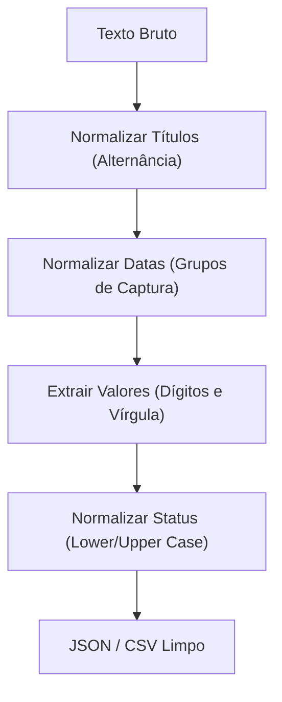

# Aula 16 – Projeto Final: O Grande Desafio 🏆

Parabéns! Você chegou à última aula do curso. Agora é hora de consolidar tudo o que aprendeu em um desafio prático que simula uma tarefa real de um Engenheiro de Dados ou Desenvolvedor Backend.

---

## 🎯 O Cenário

Você recebeu um arquivo de texto bruto (OCR) gerado a partir de notas fiscais antigas. O texto está bagunçado, com espaços extras, diferentes formatos de data e valores misturados. Sua missão é criar um "Sanitizador de Notas" usando Regex.

### Dados de Exemplo:
```text
NOTA_FISCAL #001 - DATA: 21-10-2024 - VALOR: R$ 150,00 - STATUS: Pago
nota_fiscal #002 | DATA: 22/10/2024 | VALOR: 300.00 | STATUS: pendente
NF #003; dt: 23.10.2024; val: R$ 50,50; st: PAGO
```

---

## 🛠️ Requisitos do Projeto

O seu algoritmo (em JS, Python ou apenas Regex) deve ser capaz de:

1.  **Normalizar o Título**: Identificar "NOTA_FISCAL", "nota_fiscal" ou "NF" e transformar tudo em "NF".
2.  **Padronizar a Data**: Converter todos os formatos (`-`, `/`, `.`) para o padrão brasileiro `DD/MM/AAAA`.
3.  **Limpar o Valor**: Extrair apenas o número decimal (ex: `150,00`).
4.  **Normalizar o Status**: Transformar "pendente", "Pago" ou "PAGO" em letras maiúsculas: `PAGO` ou `PENDENTE`.

---

## 📊 Estrutura de Solução Proposta



---

## 💻 Exemplo de Saída Esperada

Após o processamento, os dados devem estar assim:
- `NF #001 | 21/10/2024 | 150,00 | PAGO`
- `NF #002 | 22/10/2024 | 300,00 | PENDENTE`
- `NF #003 | 23/10/2024 | 50,50 | PAGO`

---

## 📝 Exercício Final: O Script Completo

Tente implementar a solução acima na linguagem de sua preferência.

**Dica de Python**:
```python
import re

linha = "NOTA_FISCAL #001 - DATA: 21-10-2024 - VALOR: R$ 150,00 - STATUS: Pago"

# 1. Normalizar Título
linha = re.sub(r"(NOTA_FISCAL|nota_fiscal|NF)", "NF", linha)

# 2. Normalizar Data
linha = re.sub(r"(\d{2})[-.](\d{2})[-.](\d{4})", r"\1/\2/\3", linha)

# 3. Limpar Status
if "Pago" in linha or "PAGO" in linha:
    linha = re.sub(r"STATUS: \w+", "STATUS: PAGO", linha, flags=re.I)

print(linha)
```

---

## 🎨 Conclusão do Curso

Expressões Regulares são uma ferramenta vital. Você não precisa memorizar tudo, mas agora você sabe:
- **O que procurar**: Qual metacaractere resolve seu problema.
- **Onde testar**: Usando o Regex101.
- **Como aplicar**: Em JavaScript, Python ou no Terminal.

Continue praticando e use esse superpoder para automatizar tarefas chatas no seu dia a dia! 🚀