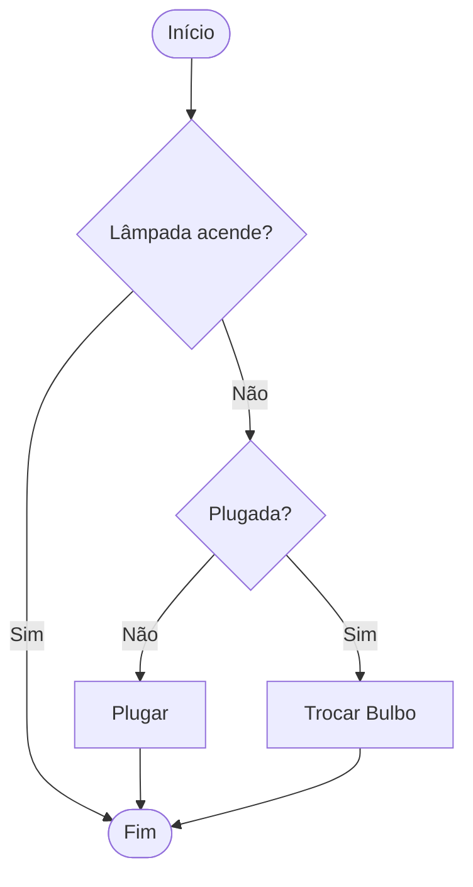

# Aula 01 - Lógica de Programação 🧠

---

## Agenda 📅

1.  O que é Lógica? <!-- .element: class="fragment" -->
2.  O Algoritmo <!-- .element: class="fragment" -->
3.  Pensamento Computacional <!-- .element: class="fragment" -->
4.  Fluxogramas <!-- .element: class="fragment" -->
5.  Ferramentas (VisualG) <!-- .element: class="fragment" -->

---

## 1. O que é Lógica? 🧠

> "A arte de pensar corretamente."

- Organização de ideias. <!-- .element: class="fragment" -->
- Maneira rigorosa de raciocinar. <!-- .element: class="fragment" -->
- **Não** é apenas para computadores! <!-- .element: class="fragment" -->
- Usamos no dia a dia sem perceber. <!-- .element: class="fragment" -->

---

## Lógica no Dia a Dia ☀️

- Se **chover**, levo guarda-chuva. <!-- .element: class="fragment" -->
- Se **estiver sol**, vou à praia. <!-- .element: class="fragment" -->
- Se o **pneu furar**, troco o pneu. <!-- .element: class="fragment" -->
- **Causa** -> **Efeito**. <!-- .element: class="fragment" -->

---

## O Computador é BURRO 🤖

- Ele não "pensa". <!-- .element: class="fragment" -->
- Ele apenas obedece. <!-- .element: class="fragment" -->
- Se você explicar errado, ele fará errado. <!-- .element: class="fragment" -->
- **Programar** = Ensinar o computador. <!-- .element: class="fragment" -->

---

## 2. O Algoritmo 💡

- **Definição**: Sequência de passos finitos e precisos para resolver um problema. <!-- .element: class="fragment" -->
- **Palavras-chave**: <!-- .element: class="fragment" -->
    - **Sequência**: A ordem importa. <!-- .element: class="fragment" -->
    - **Finitos**: Tem que acabar. <!-- .element: class="fragment" -->
    - **Precisos**: Sem "talvez". <!-- .element: class="fragment" -->

---

## Receita de Bolo 🍰

1.  Quebrar ovos. <!-- .element: class="fragment" -->
2.  Misturar farinha. <!-- .element: class="fragment" -->
3.  Assar por 40min. <!-- .element: class="fragment" -->
4.  Comer. <!-- .element: class="fragment" -->

*Se você "Comer" antes de "Assar", vai dar dor de barriga! (Ordem importa)*

---

## Estrutura Básica 🏗️

Todo algoritmo tem 3 fases:

1.  **Entrada** (Ingredientes). <!-- .element: class="fragment" -->
2.  **Processamento** (Misturar/Assar). <!-- .element: class="fragment" -->
3.  **Saída** (Bolo pronto). <!-- .element: class="fragment" -->

---

## 3. Pensamento Computacional 🧩

Os 4 Superpoderes para resolver problemas complexos.

1.  **Decomposição** <!-- .element: class="fragment" -->
2.  **Reconhecimento de Padrões** <!-- .element: class="fragment" -->
3.  **Abstração** <!-- .element: class="fragment" -->
4.  **Algoritmo** <!-- .element: class="fragment" -->

---

### 3.1 Decomposição 🧱

- Quebrar um problema grande em menores. <!-- .element: class="fragment" -->
- Exemplo: **Construir uma Casa**. <!-- .element: class="fragment" -->
    - Fazer fundação. <!-- .element: class="fragment" -->
    - Levantar paredes. <!-- .element: class="fragment" -->
    - Colocar telhado. <!-- .element: class="fragment" -->

---

### 3.2 Reconhecimento de Padrões 🔍

- Identificar o que já vimos antes. <!-- .element: class="fragment" -->
- Exemplo: <!-- .element: class="fragment" -->
    - Dirigir Carro 🚗 <!-- .element: class="fragment" -->
    - Dirigir Caminhão 🚛 <!-- .element: class="fragment" -->
    - Padrão: Volante, Pedais, Câmbio. <!-- .element: class="fragment" -->

---

### 3.3 Abstração 🌫️

- Focar no essencial. <!-- .element: class="fragment" -->
- Ignorar detalhes irrelevantes. <!-- .element: class="fragment" -->
- Exemplo: "Trocar o pneu". <!-- .element: class="fragment" -->
    - Importa: Chave de roda, Macaco. <!-- .element: class="fragment" -->
    - Não importa: Marca da borracha, cor do aro. <!-- .element: class="fragment" -->

---

### 3.4 Algoritmo (Design) 📝

- Escrever o passo a passo final. <!-- .element: class="fragment" -->
- Juntar tudo o que foi planejado. <!-- .element: class="fragment" -->
- O plano de execução. <!-- .element: class="fragment" -->

---

## 4. Fluxogramas 🗺️

A linguagem universal dos programadores.

- Desenho > Texto. <!-- .element: class="fragment" -->
- Padronizado mundialmente. <!-- .element: class="fragment" -->

---

### Símbolos Principais

| Forma | Nome | Função |
| :---: | :--- | :--- |
| `([ ... ])` | **Terminador** | Início/Fim |
| `[ ... ]` | **Processo** | Ação/Cálculo |
| `/ ... /` | **Dados** | Entrada/Saída |
| `{ ... }` | **Decisão** | Pergunta (Sim/Não) |

---

### Exemplo: Lâmpada 💡



---

## 5. VisualG e Portugol 💻

- **Portugol**: "Português Estruturado". <!-- .element: class="fragment" -->
- Uma linguagem feita para **aprender**. <!-- .element: class="fragment" -->
- Comandos em português. <!-- .element: class="fragment" -->
- Foco na lógica, não na sintaxe complexa (ainda). <!-- .element: class="fragment" -->

---

### Ferramenta: VisualG

- Gratuito. <!-- .element: class="fragment" -->
- Leve. <!-- .element: class="fragment" -->
- Roda direto no Windows. <!-- .element: class="fragment" -->
- Mostra a memória do computador. <!-- .element: class="fragment" -->

---

### Primeiro Código (Preview)

```visualg
Algoritmo "OlaMundo"
Inicio
   Escreval("Olá, Mundo!")
   Escreval("Eu sou um programador!")
FimAlgoritmo
```

> Veremos isso na prática na próxima aula!

---

## Vamos Praticar? 📝

**Desafio do Lobo/Ovelha/Alface**

- Um barqueiro. <!-- .element: class="fragment" -->
- Lobo come Ovelha. <!-- .element: class="fragment" -->
- Ovelha come Alface. <!-- .element: class="fragment" -->
- Barco só leva 1 passageiro extra. <!-- .element: class="fragment" -->
- Como atravessar todos? <!-- .element: class="fragment" -->

---

## Solução (Algoritmo)

1.  Leva Ovelha. Voltou Vazio. <!-- .element: class="fragment" -->
2.  Leva Lobo. Traz Ovelha. <!-- .element: class="fragment" -->
3.  Deixa Ovelha. Leva Alface. Voltou Vazio. <!-- .element: class="fragment" -->
4.  Leva Ovelha. <!-- .element: class="fragment" -->
5.  FIM. <!-- .element: class="fragment" -->

---

## Resumo ✅

- Lógica = Pensar certo. <!-- .element: class="fragment" -->
- Algoritmo = Sequência de passos. <!-- .element: class="fragment" -->
- 3 Fases: Entrada, Processamento, Saída. <!-- .element: class="fragment" -->
- Fluxogramas ajudam a desenhar a solução. <!-- .element: class="fragment" -->

---

## Próxima Aula 🚀

- Configurar o VisualG. <!-- .element: class="fragment" -->
- Entender **Variáveis** (As caixas da memória). <!-- .element: class="fragment" -->
- Tipos de Dados (Texto, Número, Lógico). <!-- .element: class="fragment" -->

👉 **Instalem o VisualG!**