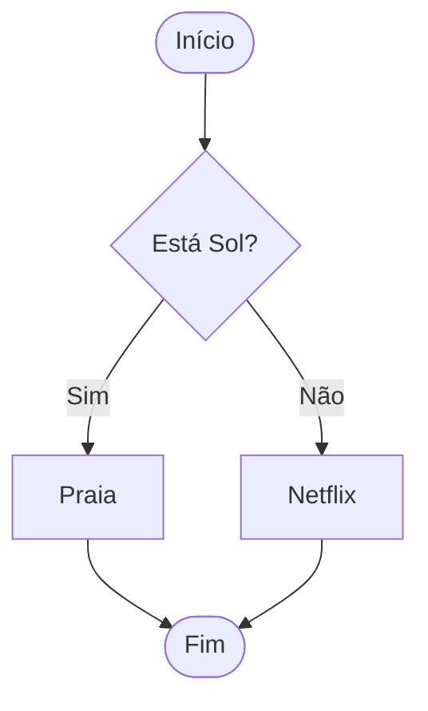

# Aula 04 - Estrutura Condicional 🔀

---

## Agenda 📅

1.  O Desvio Lógico ("Se...") <!-- .element: class="fragment" -->
2.  Operadores Relacionais <!-- .element: class="fragment" -->
3.  Estrutura Se-Entao-Senao <!-- .element: class="fragment" -->
4.  Operadores Lógicos (E, OU, NÃO) <!-- .element: class="fragment" -->
5.  Estrutura Escolha-Caso <!-- .element: class="fragment" -->

---

## 1. O Desvio Lógico 🤔

Até agora, nossos programas eram uma linha reta.
Mas a vida é feita de escolhas.

- **Se** chover, pego guarda-chuva. <!-- .element: class="fragment" -->
- **Senão**, vou de bicicleta. <!-- .element: class="fragment" -->

---

### Visualizando a Decisão



---

## 2. Operadores Relacionais 📏

Para o computador decidir, ele precisa **comparar**.
A resposta é sempre **Verdadeiro** ou **Falso**.

---

### Os Comparadores

| Símbolo | Significado | Exemplo | Resultado |
| :---: | :--- | :--- | :--- |
| `>` | Maior que | `10 > 5` | V |
| `<` | Menor que | `3 < 8` | V |
| `==` | Igual a | `5 == 5` | V |
| `!=` | Diferente | `5 != 3` | V |
| `>=` | Maior/Igual | `10 >= 10` | V |

---

## 3. Sintaxe Básica (Se-Entao) 📝

```visualg
se (nota >= 7) entao
   escreva("Aprovado!")
fimse
```

- Se a condição for **Verdadeira**, ele executa o bloco. <!-- .element: class="fragment" -->
- Se for **Falsa**, ele pula. <!-- .element: class="fragment" -->

---

### O "Senao" (O Plano B)

E se for Falso? Usamos o `senao`.

```visualg
se (nota >= 7) entao
   escreva("Aprovado!")
senao
   escreva("Reprovado!")
fimse
```

---

## 4. Operadores Lógicos 🔗

Às vezes, uma condição só não basta.

- Quero ir à praia **SE** tiver sol **E** for sábado. <!-- .element: class="fragment" -->

---

### Operador E (AND) 🤝

- Exige que **TODAS** as condições sejam verdadeiras. <!-- .element: class="fragment" -->

| A | B | A e B |
| :---: | :---: | :---: |
| V | V | **V** |
| V | F | F |
| F | V | F |
| F | F | F |

---

### Operador OU (OR) 🤷

- Exige que **PELO MENOS UM** seja verdadeiro. <!-- .element: class="fragment" -->

| A | B | A ou B |
| :---: | :---: | :---: |
| V | V | **V** |
| V | F | **V** |
| F | V | **V** |
| F | F | F |

---

### Operador NÃO (NOT) 🚫

- Inverte o resultado. <!-- .element: class="fragment" -->

| A | NÃO A |
| :---: | :---: |
| V | F |
| F | V |

---

## Exemplo Prático: Média Escolar 🎓

Vamos melhorar nosso cálculo de média.

- Media >= 7: Aprovado. <!-- .element: class="fragment" -->
- Media >= 5 E Media < 7: Recuperação. <!-- .element: class="fragment" -->
- Media < 5: Reprovado. <!-- .element: class="fragment" -->

---

### O Código (Aninhado)

```visualg
se (media >= 7) entao
   escreval("Aprovado")
senao
   se (media >= 5) entao
      escreval("Recuperação")
   senao
      escreval("Reprovado")
   fimse
fimse
```

---

## 5. Estrutura Escolha-Caso 🚦

Quando temos muitas opções fixas (como um Menu).
Evita aquele monte de `se-senao-se-senao`.

---

### Exemplo: Menu

```visualg
escolha (opcao)
   caso 1
      escreva("Iniciar Jogo")
   caso 2
      escreva("Configurações")
   caso 3
      escreva("Sair")
   outrocaso
      escreva("Opção Inválida")
fimescolha
```

---

### Quando usar qual? 🤔

- **SE**: Para testar intervalos (`idade > 18`), condições complexas (`E`, `OU`). <!-- .element: class="fragment" -->
- **ESCOLHA**: Para valores exatos (Menus, Códigos de produto). <!-- .element: class="fragment" -->

---

## Exercício Rápido ⚡

**Par ou Ímpar?**

1.  Leia um número. <!-- .element: class="fragment" -->
2.  Verifique se o resto da divisão por 2 é zero. <!-- .element: class="fragment" -->
3.  Se for, é Par. <!-- .element: class="fragment" -->
4.  Senão, é Ímpar. <!-- .element: class="fragment" -->

---

## Resumo ✅

- **Se/Então/Senão**: Tomada de decisão. <!-- .element: class="fragment" -->
- **Relacionais**: `>`, `<`, `=`, `!=`. <!-- .element: class="fragment" -->
- **Lógicos**: `E`, `OU`, `NÃO`. <!-- .element: class="fragment" -->
- **Escolha**: Ótimo para menus. <!-- .element: class="fragment" -->

---

## Próxima Aula 🚀

- E se eu quiser repetir um comando 1000 vezes? <!-- .element: class="fragment" -->
- **Loops** (Laços de Repetição). <!-- .element: class="fragment" -->
- `Enquanto`, `Para`, `Repita`. <!-- .element: class="fragment" -->

👉 **Tarefa**: Fazer o exercício do Bhaskara!