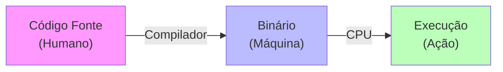

# Aula 02 - Ambiente e Ferramentas 🛠️

---

## Agenda 📅

1.  O Ciclo de Vida do Código { .fragment }
2.  Ferramentas de Aprendizado (Low Code) { .fragment }
3.  Visual Studio Code (A Ferramenta Real) { .fragment }
4.  O Terminal (Sem Medo!) { .fragment }
5.  Instalação e Configuração { .fragment }

---

## 1. O Ciclo de Vida do Código 🔄

Como o computador entende o que escrevemos?

- **Nós**: Falamos Inglês/Português (Texto). { .fragment }
- **Computador**: Fala Energia (0 e 1). { .fragment }
- **O Problema**: Tradução. { .fragment }

---

## As 3 Etapas 🚦

1.  **Código Fonte**: O texto que você digita. { .fragment }
2.  **Compilação/Interpretação**: A tradução mágica. { .fragment }
3.  **Execução (Binário)**: O programa rodando. { .fragment }

---

### Visualizando o Processo



---

## Código Fonte 📝

- Arquivos de texto simples (`.alg`, `.py`, `.c`, `.java`). { .fragment }
- Legível para humanos. { .fragment }
- Exemplo: { .fragment }
    ```visualg
    escreva("Olá Mundo")
    ```

---

## Compilador ⚙️

- O "Tradutor". { .fragment }
- Verifica se você escreveu certo (Sintaxe). { .fragment }
- Transforma em linguagem de máquina. { .fragment }
- Se tiver erro, ele GRITA (Erro de Compilação). { .fragment }

---

## Binário / Executável 🚀

- O resultado final. { .fragment }
- `.exe` (Windows), App Mobile. { .fragment }
- O usuário final só vê isso. { .fragment }
- Não dá para ler (só números e símbolos estranhos). { .fragment }

---

## 2. Ferramentas Low Code 🧩

Para começar **sem frustração**.

- Foco na **Lógica**. { .fragment }
- Esqueça "ponto-e-vírgula" por enquanto. { .fragment }
- VisualG e Scratch. { .fragment }

---

### VisualG 🟦

- **Linguagem**: Portugol (Português Estruturado). { .fragment }
- **Interface**: Simples, leve. { .fragment }
- **Diferencial**: Mostra o valor das variáveis em tempo real (Memória). { .fragment }
- **Uso**: Exclusivo para ensino no Brasil. { .fragment }

---

### Exemplo VisualG

```visualg
Algoritmo "Exemplo"
Var
   nome : caractere
Inicio
   escreva("Qual seu nome? ")
   leia(nome)
   escreva("Olá, ", nome)
Fimalgoritmo
```
> Parece português, funciona como código.

---

### Scratch 🐱

- Criado pelo MIT. { .fragment }
- Programação em **Blocos** (Lego). { .fragment }
- Impossível errar sintaxe (os blocos só encaixam se estiver certo). { .fragment }
- Ótimo para entender loops e eventos. { .fragment }

---

## 3. Visual Studio Code (VS Code) 💻

A ferramenta profissional.

- Gratuito (Microsoft). { .fragment }
- Leve. { .fragment }
- **Extensível**. { .fragment }

---

### Por que VS Code? 🌟

1.  **IntelliSense**: Autocomplete inteligente. { .fragment }
2.  **Multi-Linguagem**: Python, Java, C++, HTML... tudo num lugar só. { .fragment }
3.  **Terminal Integrado**: Não precisa abrir janelas extras. { .fragment }
4.  **Comunidade**: Milhares de plugins. { .fragment }

---

### Extensões Essenciais 🧩

Sem elas, ele é apenas um bloco de notas.

- **Portuguese (Brazil)**: Traduz o menu. { .fragment }
- **Material Icon Theme**: Ícones bonitos para arquivos. { .fragment }
- **Code Runner**: Roda código com um clique. { .fragment }
- **Live Server**: Para Web (HTML). { .fragment }

---

## 4. O Terminal (Tela Preta) 🖥️

Não tenha medo da tela preta!

- É o modo "Hacker" (mas simples). { .fragment }
- Controle total do sistema. { .fragment }
- Mais rápido que clicar com o mouse. { .fragment }

---

### Comandos Básicos (Windows/Linux)

| Comando | Função | Exemplo |
| :--- | :--- | :--- |
| `cd` | Change Directory (Mudar Pasta) | `cd projetos` |
| `ls` ou `dir` | List (Listar arquivos) | `ls` |
| `mkdir` | Make Directory (Criar Pasta) | `mkdir aula01` |
| `clear` ou `cls` | Clear Screen (Limpar) | `cls` |

---

## 5. Prática: Olá Mundo 🌍

Vamos criar nosso primeiro programa no VisualG.

1.  Abra o VisualG. { .fragment }
2.  No bloco `Inicio`, digite: { .fragment }
    ```visualg
    Escreval("Olá, Mundo!")
    ```
3.  Aperte **F9** (Executar). { .fragment }

---

### Onde Configurar? 🛠️

Preparamos guias passo a passo para você instalar tudo.

- [Setup 01 - VisualG](../setups/setup-01.md) (Comece aqui!) { .fragment }
- [Setup 03 - VS Code](../setups/setup-03.md) (Para depois) { .fragment }

---

## Resumo ✅

- Código Fonte -> Compilador -> Binário. { .fragment }
- VisualG = Treino de Lógica. { .fragment }
- VS Code = ferramenta Profissional. { .fragment }
- Terminal = Poder e Velocidade. { .fragment }

---

## Próxima Aula 🚀

- Entrar na "Mente do Computador". { .fragment }
- **Variáveis**: Como o computador guarda informações? { .fragment }
- **Tipos de Dados**: Texto, Número Inteiro, Número Real, Lógico. { .fragment }

👉 **Tarefa de Casa**: Instalar VisualG e rodar o "Olá Mundo".