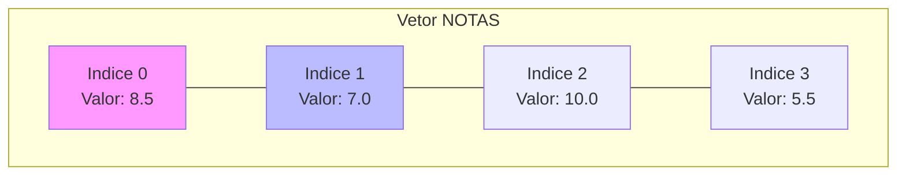

# Aula 06 - Estruturas de Dados I: Vetores 📊

---

## Agenda 📅

1.  O Problema das Muitas Variáveis { .fragment }
2.  O Que é um Vetor? { .fragment }
3.  Simulando a Memória { .fragment }
4.  Declarando e Acessando { .fragment }
5.  Percorrendo Vetores (Loop Para) { .fragment }
6.  Ordenação (Bubble Sort) { .fragment }

---

## 1. O Problema 😫

Imagine guardar a nota de 50 alunos.

- `nota1`, `nota2`, `nota3`... `nota50`. { .fragment }
- E para calcular a média? { .fragment }
    - `(nota1 + nota2 + ... + nota50) / 50` { .fragment }
- **Caos Total!** Código gigante e difícil de manter. { .fragment }

---

## 2. A Solução: Vetores (Arrays) 📏

- Uma variável "comprida". { .fragment }
- Guarda **muitos valores** do **mesmo tipo**. { .fragment }
- Cada valor tem um endereço (**Índice**). { .fragment }
- Como uma planilha do Excel de uma linha só. { .fragment }

---

### Visualizando a Memória



---

## Índice (Index) 🔢

- É o endereço da gaveta. { .fragment }
- Começa no **0** (na maioria das linguagens). { .fragment }
- `notas[0]` é a primeira nota. { .fragment }
- `notas[49]` é a 50ª nota. { .fragment }

---

## 3. Declarando um Vetor 📝

No VisualG/Portugol:

```portugol
Var
   // Um vetor de 5 posições (0 a 4)
   notas : vetor [0..4] de real
   nomes : vetor [0..9] de caractere
```

---

## 4. Acessando Dados 🗝️

Como ler e escrever numa posição específica?

### Escrevendo (Guardando)

```portugol
notas[0] <- 8.5
notas[1] <- 7.0
```

### Lendo (Mostrando)

```portugol
escreva(notas[0]) // Mostra 8.5
```

---

## 5. A Combinação Perfeita: Vetor + Para 🤝

Se temos índices sequenciais (0, 1, 2...), usamos um **Loop Para** para percorrer.

---

### Preenchendo Automaticamente

```visualg
para i de 0 ate 4 faca
   escreva("Digite a nota ", i, ": ")
   leia(notas[i])
fimpara
```

> Muito melhor do que 5 `leia` separados!

---

### Mostrando Tudo

```visualg
para i de 0 ate 4 faca
   escreval("Nota ", i, ": ", notas[i])
fimpara
```

---

## Somando Valores ➕

Como somar todas as notas?
Usamos um **Acumulador**.

```visualg
soma <- 0
para i de 0 ate 4 faca
   soma <- soma + notas[i]
fimpara
media <- soma / 5
```

---

## 6. Ordenação (Bubble Sort) 🫧

E se quisermos colocar em ordem crescente?
Existem algoritmos famosos para isso. O mais simples é o **Bolha**.

- Ideia: O maior valor "flutua" para o final. { .fragment }
- Compara pares de vizinhos. { .fragment }

---

### O Algoritmo da Troca 🔄

Se o vizinho da esquerda for maior que o da direita, **TROQUE**.

```visualg
se (vet[i] > vet[i+1]) entao
   temp    <- vet[i]
   vet[i]   <- vet[i+1]
   vet[i+1] <- temp
fimse
```

---

### Exemplo Visual 🛁

Vetor: `[5, 1, 4]`

1.  Compara 5 e 1. 5 > 1? Sim. Troca. -> `[1, 5, 4]` { .fragment }
2.  Compara 5 e 4. 5 > 4? Sim. Troca. -> `[1, 4, 5]` { .fragment }
3.  Pronto! O 5 (maior) foi pro final. { .fragment }

---

## 7. Erros Comuns ⚠️

1.  **Estourar o Vetor**: { .fragment }
    - Tentar acessar `notas[5]` num vetor de 0..4. { .fragment }
    - O programa trava (Index Out Of Bounds). { .fragment }
2.  **Confundir Índice com Valor**: { .fragment }
    - `i` é a posição. { .fragment }
    - `vet[i]` é o valor naquela posição. { .fragment }

---

## Exercício Rápido ⚡

**Invertendo a Ordem**

1.  Leia 5 nomes. { .fragment }
2.  Guarde num vetor. { .fragment }
3.  Mostre do **último para o primeiro**. { .fragment }
    - Dica: `para i de 4 ate 0 passo -1`. { .fragment }

---

## Resumo ✅

- Vetor = Variável composta. { .fragment }
- Índice começa em 0. { .fragment }
- Loop `Para` é o melhor amigo do Vetor. { .fragment }
- Ordenação organiza os dados. { .fragment }

---

## Próxima Aula 🚀

- E se precisarmos de linhas E colunas? { .fragment }
- Planilhas, Tabuleiros, Jogos. { .fragment }
- **Matrizes** (Vetores Bidimensionais). { .fragment }

👉 **Tarefa**: Fazer o exercício "Rei da Montanha" (Achar o maior valor)!