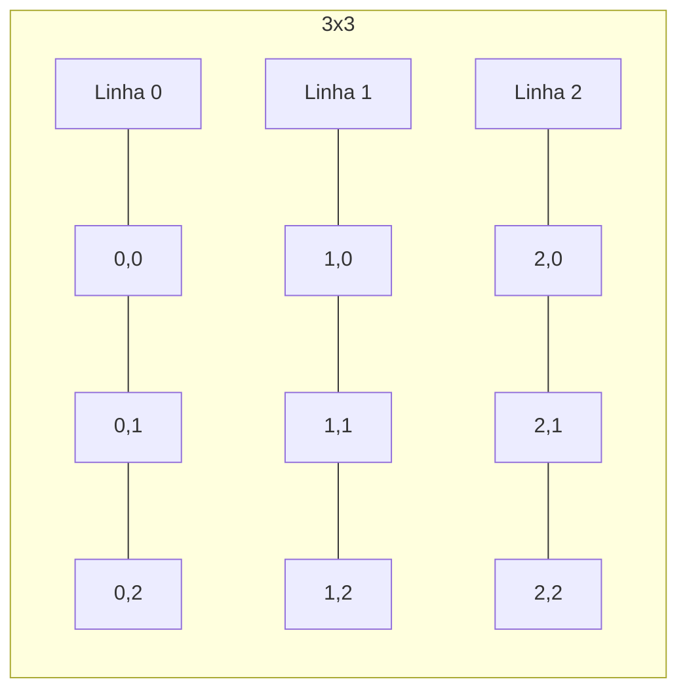

# Aula 07 - Estruturas de Dados II: Matrizes 📈

---

## Agenda 📅

1.  O Mundo em 2D { .fragment }
2.  O Que é uma Matriz? { .fragment }
3.  Coordenadas (Linha x Coluna) { .fragment }
4.  Percorrendo Matrizes { .fragment }
5.  Aplicações Práticas { .fragment }

---

## 1. O Mundo em 2D 🗺️

Nem tudo cabe numa lista (Vetor).

- Uma sala de cinema. { .fragment }
- Um tabuleiro de xadrez. { .fragment }
- Uma planilha do Excel. { .fragment }
- Precisamos de **2 Dimensões**: Altura e Largura. { .fragment }

---

## 2. O Que é uma Matriz? 🏗️

- É um **"Vetor de Vetores"**. { .fragment }
- Tem Linhas (Horizontais) e Colunas (Verticais). { .fragment }
- Cada "casinha" tem um endereço duplo. { .fragment }

---

### Visualizando uma Matriz



---

## 3. Coordenadas (Linha, Coluna) 📍

Assim como na Batalha Naval: `B4`, `A1`.
Na programação, usamos índices numéricos.

- `matriz[LINHA][COLUNA]` { .fragment }
- Sempre **LINHA primeiro**, depois COLUNA. { .fragment }

---

### Sintaxe VisualG

```portugol
Var
   // 3 Linhas, 3 Colunas
   tabuleiro : vetor [0..2, 0..2] de inteiro
Inicio
   // Colocando valor no centro
   tabuleiro[1][1] <- 5
   
   // Canto superior esquerdo
   tabuleiro[0][0] <- 1
```

---

## 4. Percorrendo uma Matriz 🔄🔄

Se um vetor precisa de 1 loop, a matriz precisa de **2 Loops Aninhados**.

1.  O primeiro trava a **Linha**. { .fragment }
2.  O segundo percorre todas as **Colunas** daquela linha. { .fragment }

---

### O Código Padrão

```portugol
para i de 0 ate 2 faca  // Linhas
   para j de 0 ate 2 faca  // Colunas
      escreva("Posição [", i, ",", j, "]: ")
      leia(matriz[i][j])
   fimpara
fimpara
```

---

### Visualizando a Execução

1.  `i=0, j=0` -> [0,0] { .fragment }
2.  `i=0, j=1` -> [0,1] { .fragment }
3.  `i=0, j=2` -> [0,2] -> Fim das Colunas. { .fragment }
4.  `i=1, j=0` -> [1,0] -> Nova Linha! { .fragment }

---

## 5. Matriz Identidade 🆔

Um clássico da matemática.
Diagonal Principal = 1. Resto = 0.

- A Diagonal Principal acontece quando `i == j` (0,0; 1,1; 2,2). { .fragment }

```portugol
se (i == j) entao
   matriz[i][j] <- 1
senao
   matriz[i][j] <- 0
fimse
```

---

## 6. Aplicações Reais 🌍

Onde usamos isso?

1.  **Imagens**: Cada pixel é uma célula com cor (RGB). { .fragment }
2.  **Jogos**: O mapa do jogo (Tilemap). { .fragment }
3.  **Gráficos 3D**: Matrizes de transformação. { .fragment }

---

## Exercício Rápido ⚡

**Soma Total**

1.  Crie uma matriz 2x2. { .fragment }
2.  Preencha com números. { .fragment }
3.  Use dois loops para somar TUDO. { .fragment }
4.  Mostre o total. { .fragment }

---

## Resumo ✅

- Matriz = Linhas x Colunas. { .fragment }
- Declaração: `vetor [L..L, C..C]`. { .fragment }
- Acesso: `mat[linha][coluna]`. { .fragment }
- Percorrer: 2 loops `Para`. { .fragment }

---

## Próxima Aula 🚀

- Nossos códigos estão ficando grandes... { .fragment }
- Como organizar? { .fragment }
- **Modularização**: Dividir para Conquistar. { .fragment }
- Funções e Procedimentos. { .fragment }

👉 **Tarefa**: Jogue Batalha Naval (no papel ou no código)!