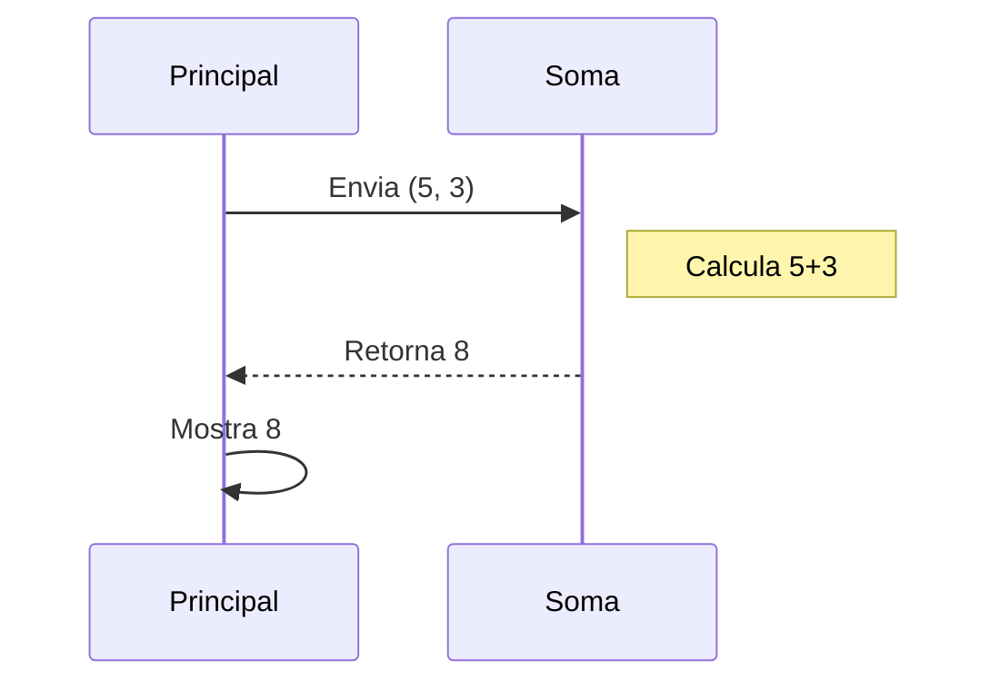

# Aula 08 - Modularização 🧩

---

## Agenda 📅

1.  Conceito de Módulos (Divide & Conquer) { .fragment }
2.  Procedimentos vs Funções { .fragment }
3.  Escopo de Variáveis (Locais x Globais) { .fragment }
4.  Parâmetros (Valor x Referência) { .fragment }
5.  Exemplos Práticos { .fragment }

---

## 1. Dividir para Conquistar ⚔️

Imagine construir um carro inteiro num bloco só. Impossível!
Nós montamos:
- Motor 🔧 { .fragment }
- Rodas 🚗 { .fragment }
- Vidros 🪟 { .fragment }
E depois **juntamos**.

---

### Na Programação

- Não escreva 1000 linhas no `Inicio`. { .fragment }
- Quebre em pequenos blocos (**Módulos**). { .fragment }
- Cada módulo resolve **um problema específico**. { .fragment }

---

### Visualizando (Mermaid)



---

## 2. Tipos de Módulos 🛠️

Em Portugol, temos dois tipos principais.

1.  **Procedimentos**: Fazem uma ação, mas não devolvem valor matemático. { .fragment }
2.  **Funções**: Calculam e **RETORNAM** um valor. { .fragment }

---

### Procedimento (Ação)

Ex: `LimparTela()`, `MostrarMenu()`, `TocarSom()`.

```portugol
procedimento saudacao(nome : caractere)
inicio
   escreval("Olá, ", nome)
fimprocedimento
```
> Chamada: `saudacao("João")`

---

### Função (Cálculo)

Ex: `Raiz(x)`, `Soma(a,b)`, `Media(n1,n2)`.
Tem a palavra mágica **RETORNE**.

```portugol
funcao somar(a, b : inteiro) : inteiro
inicio
   retorne a + b
fimfuncao
```
> Chamada: `res <- somar(2, 3)`

---

## 3. Escopo de Variáveis 🏠

Onde minha variável vive?

- **Global**: Criada fora de tudo. Todo mundo vê. (Perigoso!). { .fragment }
- **Local**: Criada dentro da função. Só a função vê. (Seguro!). { .fragment }

---

### O Muro das Funções 🧱

Se eu crio `x` dentro de `somar`, o `Principal` **não sabe** quem é `x`.
Isso evita confusão!

---

## 4. Parâmetros 🚚

Como passar dados para a função?

1.  **Por Valor** (O padrão): Envia uma **CÓPIA**. Se a função mudar, o original não muda. { .fragment }
2.  **Por Referência** (`var`): Envia o **ENDEREÇO**. Se a função mudar, o original MUDA! { .fragment }

---

### Exemplo: Troca de Valores

Precisa ser por Referência!

```portugol
procedimento troca(var a, var b : inteiro)
inicio
   temp <- a
   a <- b
   b <- temp
fimprocedimento
```

---

## 5. Vantagens da Modularização ✅

1.  **Reutilização**: Escreve uma vez, usa 1000 vezes. { .fragment }
2.  **Organização**: Código limpo. { .fragment }
3.  **Facilidade de Manutenção**: Se o cálculo mudar, corrijo num lugar só. { .fragment }

---

## Projeto Final Módulo 1 🏆

**Sistema de Notas Completo**

- Use Vetores. { .fragment }
- Use Matrizes (se quiser). { .fragment }
- Use Funções para calcular média. { .fragment }
- Use Procedimentos para mostrar boletim. { .fragment }

---

## Resumo ✅

- Modularizar = Organizar. { .fragment }
- **Função** retorna valor. **Procedimento** faz ação. { .fragment }
- Variáveis **Locais** são protegidas. { .fragment }
- Use parâmetros para comunicar. { .fragment }

---

## Próxima Aula 🚀

- Fim da "Lógica Pura"! { .fragment }
- Vamos conhecer linguagens reais. { .fragment }
- **C e C++**: Os pais da programação moderna. { .fragment }
- Gerenciamento de Memória na unha! { .fragment }

👉 **Tarefa**: Refatore seus códigos antigos usando Funções!