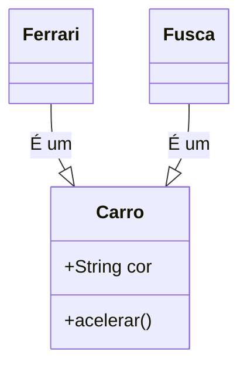

# Aula 11 - Java e Orientação a Objetos ☕

---

## Agenda 📅

1.  O Mundo dos Objetos { .fragment }
2.  Classes vs Objetos { .fragment }
3.  Java e a JVM { .fragment }
4.  Os 3 Pilares da OO { .fragment }
5.  Spring Boot (Java Moderno) { .fragment }

---

## 1. O Mundo Orientado a Objetos 🌍

Até agora, programamos **Ações** (Funções).
Mas o mundo é feito de **Coisas** (Objetos).

- **Estruturada**: Verbo (Fazer algo). { .fragment }
- **OO**: Substantivo (Algo que faz). { .fragment }

---

## 2. Classe vs Objeto 🏗️

A distinção mais importante.

- **Classe**: O Molde. A Planta. A Ideia. (Abstrato). { .fragment }
- **Objeto**: A Instância. A Casa. A Coisa Real. (Concreto). { .fragment }

---

### Visualizando (Mermaid)



---

## 3. Java e a JVM ♻️

"Write Once, Run Anywhere" (Escreva uma vez, rode em qualquer lugar).

- O Java não compila para Binário direto. { .fragment }
- Ele compila para **Bytecode** (`.class`). { .fragment }
- A **JVM** (Máquina Virtual Java) roda esse Bytecode em qualquer sistema (Windows, Linux, Android, Geladeira). { .fragment }

---

## 4. Os 3 Pilares da OO 🏛️

1.  Encapsulamento { .fragment }
2.  Herança { .fragment }
3.  Polimorfismo { .fragment }

---

### Encapsulamento 🛡️

Proteger os dados. Ninguém mexe no cofre do banco direto.

- **Private**: Só a classe vê. { .fragment }
- **Public**: Todo mundo vê. { .fragment }
- **Getters/Setters**: Porteiros que controlam o acesso. { .fragment }

```java
private double saldo;

public void depositar(double valor) {
    if (valor > 0) saldo += valor;
}
```

---

### Herança 🧬

Reaproveitar código.

- `Cachorro` **é um** `Animal`. { .fragment }
- `Gato` **é um** `Animal`. { .fragment }
- Tudo que `Animal` tem, eles herdam (nome, idade). { .fragment }

```java
public class Cachorro extends Animal { ... }
```

---

### Polimorfismo 🎭

Muitas formas.

- O método `fazerSom()` existe em Animal. { .fragment }
- No Cachorro, ele faz "Au Au". { .fragment }
- No Gato, ele faz "Miau". { .fragment }
- O mesmo método se comporta diferente. { .fragment }

---

## 5. Spring Boot 🍃

Java não é só "tela preta".
É a linguagem nº 1 em Bancos e Grandes Empresas.

- **Spring Boot**: Framework para criar APIs Web. { .fragment }
- Tira toda a configuração chata. { .fragment }

---

### Exemplo de API

```java
@RestController
public class OlaController {
    
    @GetMapping("/ola")
    public String dizerOla() {
        return "Olá, Mundo Java Web!";
    }
}
```

---

## Exercício Mental 🧠

Modele um sistema de **Venda**.

- Classes: `Produto`, `Cliente`, `Venda`. { .fragment }
- Atributos: `Preco`, `Nome`. { .fragment }
- Métodos: `CalcularTotal()`, `Pagar()`. { .fragment }

---

## Resumo ✅

- **Classe** é molde, **Objeto** é real. { .fragment }
- **JVM** garante portabilidade. { .fragment }
- **Encapsulamento** protege. { .fragment }
- **Herança** reutiliza. { .fragment }
- **Polimorfismo** flexibiliza. { .fragment }

---

## Próxima Aula 🚀

- O concorrente direto do Java. { .fragment }
- Criado pela Microsoft. { .fragment }
- **C# e plataforma .NET**. { .fragment }
- Foco em produtividade. { .fragment }

👉 **Tarefa**: Instalar o JDK (Java Development Kit) e o VS Code Extension Pack for Java!