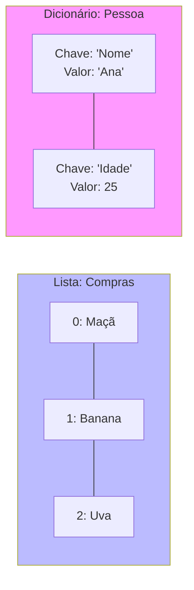

# Aula 13 - Python e Ciência de Dados 🐍

---

## Agenda 📅

1.  Por que Python? { .fragment }
2.  Sintaxe Limpa { .fragment }
3.  Estruturas de Dados Poderosas { .fragment }
4.  Modo Interativo (REPL) vs Scripts { .fragment }
5.  O Ecossistema de Data Science { .fragment }

---

## 1. Por que Python? 🚀

- **Legibilidade**: Parece inglês. { .fragment }
- **Produtividade**: Menos linhas, mais resultado. { .fragment }
- **Ecossistema**: IA, Data Science, Web, Automação. { .fragment }
- Não é o mais rápido (em CPU), mas é o mais rápido para **desenvolver**. { .fragment }

---

## 2. Sintaxe Limpa ✨

Esqueça `{}` e `;`.

- **Indentação** (espaços) define os blocos. { .fragment }
- Força o código a ser organizado. { .fragment }

```python
if idade >= 18:
    print("Maior")
else:
    print("Menor")
```

---

## 3. Estruturas de Dados 🧱

Em vez de Arrays e Matrizes chatos de declarar, temos **Listas** e **Dicionários**.

---

### Listas (Arrays Turbinados)

```python
frutas = ["Maçã", "Banana", "Uva"]
print(frutas[0]) # Maçã
frutas.append("Pera") # Adiciona no fim
```

---

### Dicionários (Chave-Valor) 🔑

Como um JSON ou um Objeto.

```python
pessoa = {
    "nome": "Ana",
    "idade": 25,
    "tech": ["Python", "SQL"]
}
print(pessoa["nome"])
```

---

### Visualizando (Mermaid)



---

## 4. Modos de Execução ⚙️

1.  **REPL (Interativo)**: { .fragment }
    - Digite `python` no terminal. { .fragment }
    - Teste comandos na hora. `2 + 2`. { .fragment }
    - Ótimo para aprender. { .fragment }

2.  **Scripts (`.py`)**: { .fragment }
    - Arquivos de texto com código. { .fragment }
    - `python meu_script.py`. { .fragment }
    - Para programas reais. { .fragment }

---

## 5. O Ecossistema de Dados 📊

Por que Data Science ama Python? **Bibliotecas**.

1.  **Pandas**: O "Excel" do programador. Manipula milhões de linhas. { .fragment }
2.  **Matplotlib**: Cria gráficos (Barras, Linhas, Pizza). { .fragment }
3.  **TensorFlow/PyTorch**: Inteligência Artificial. { .fragment }

---

### Exemplo Pandas 🐼

```python
import pandas as pd

# Ler uma planilha inteira
tabela = pd.read_csv("vendas.csv")

# Calcular totais
print(tabela["valor"].sum())
```

---

## Exercício Rápido ⚡

**Análise de Notas**

1.  Crie uma lista com 4 notas: `[6.0, 7.5, 9.0, 5.5]`. { .fragment }
2.  Use `sum(lista)` e `len(lista)` para calcular a média. { .fragment }
3.  Se média > 6, imprima "Aprovado". { .fragment }

```python
notas = [6.0, 7.5, 9.0, 5.5]
media = sum(notas) / len(notas)
# Complete...
```

---

## Resumo ✅

- Python é a linguagem da prototipagem e dos dados. { .fragment }
- **Indentação** é regra. { .fragment }
- **Bibliotecas** fazem o trabalho pesado. { .fragment }

---

## Próxima Aula 🚀

- E quando performance é tudo? { .fragment }
- Sistemas que não podem travar. { .fragment }
- **Rust e Go**: As linguagens da Cloud e Sistemas. { .fragment }

👉 **Tarefa**: Instalar Python e fazer o exercício da média!