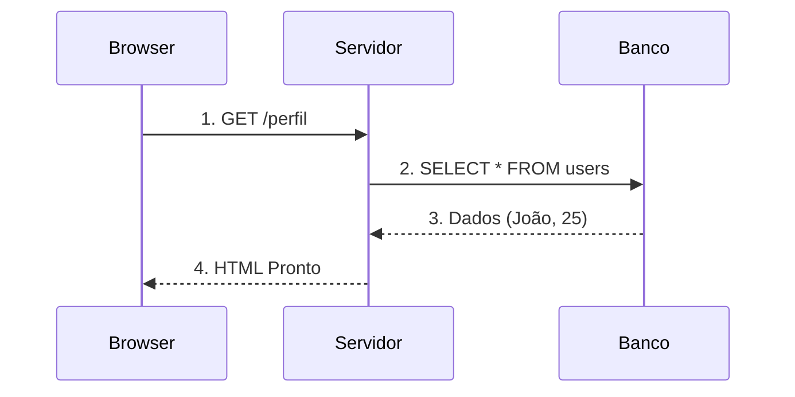
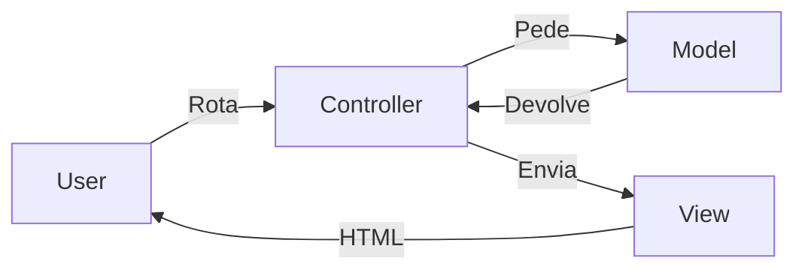

# Aula 16 - PHP e o Lado do Servidor 🐘

---

## Agenda 📅

1.  Como a Web Funciona? { .fragment }
2.  PHP: O Motor da Internet { .fragment }
3.  Arquitetura MVC { .fragment }
4.  Laravel (Framework) { .fragment }
5.  Projeto Final { .fragment }

---

## 1. O Ciclo da Web 🌍

Client vs Server.

- **Cliente (Browser)**: Pede coisas (Request). { .fragment }
- **Servidor**: Processa e Devolve (Response). { .fragment }
- **Banco de Dados**: Guarda as informações. { .fragment }

---

### Requisição e Resposta (Sequence)



---

## 2. O Que é PHP? 🐘

**P**HP: **H**ypertext **P**reprocessor.

- Roda no Servidor (Back-end). { .fragment }
- Gera HTML dinâmico. { .fragment }
- Fácil de hospedar (qualquer servidor barato tem). { .fragment }
- Poderoso (Facebook, Wikipedia, WordPress). { .fragment }

---

### Código PHP

```php
<?php
    $nome = "Maria";
    $saldo = 100.50;
    
    echo "<h1>Olá, $nome!</h1>";
    echo "<p>Saldo: $saldo</p>";
?>
```

---

## 3. Arquitetura MVC 🏗️

Para organizar sites grandes, não misturamos código.

- **M**odel (Modelo): Dados e Banco. { .fragment }
- **V**iew (Visão): HTML e Telas. { .fragment }
- **C**ontroller (Controlador): A Lógica. { .fragment }

---

### Fluxo MVC



---

## 4. Laravel 🚀

O Framework PHP mais popular.

- Sintaxe elegante. { .fragment }
- Ferramentas prontas (Login, Email, Banco). { .fragment }
- "O PHP Moderno". { .fragment }

```php
// Rota simples em Laravel
Route::get('/', function () {
    return view('welcome');
});
```

---

## Projeto Final do Curso 🏆

**Mural de Recados Fullstack**

- **Banco**: MySQL (`recados`: id, mensagem). { .fragment }
- **Back**: PHP (Busca recados). { .fragment }
- **Front**: HTML/CSS (Mostra recados). { .fragment }
- Use tudo que aprendeu: Lógica, Loops, Vetores (Dados do banco), HTML. { .fragment }

---

## Termynal: Servidor PHP 🖥️

<div data-termynal class="termy">
    <span data-ty="input">php -S localhost:8000</span>
    <span data-ty="progress">Listening on localhost:8000...</span>
    <span data-ty>Requisição recebida: /index.php</span>
    <span data-ty>200 OK</span>
</div>

---

## Resumo do Módulo ✅

1.  **Lógica**: Algoritmos, Fluxogramas. { .fragment }
2.  **Dados**: Variáveis, Vetores, Matrizes. { .fragment }
3.  **Tecnologias**: { .fragment }
    - Baixo nível (C/C++). { .fragment }
    - Web (JS, PHP). { .fragment }
    - Mobile (Flutter). { .fragment }
    - Corporativo (Java, C#). { .fragment }

---

## Parabéns! 🎓

Você completou a jornada de Lógica e Algoritmos.
Você agora tem a **base** para aprender qualquer linguagem.

**Próximos Passos?**
- Escolha uma área (Front, Back, Mobile, Dados). { .fragment }
- Aprofunde-se na linguagem escolhida. { .fragment }
- **PRATIQUE!** { .fragment }

👉 **Projeto Final**: Entregar o Mural de Recados!