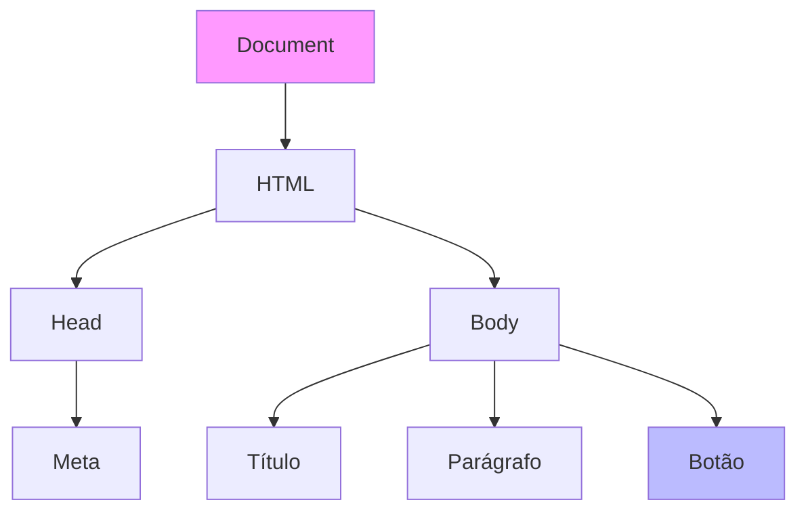

# Aula 10 - Web Moderna: JS e TS 🌐

---

## Agenda 📅

1.  O Navegador como SO <!-- .element: class="fragment" -->
2.  O DOM (Document Object Model) <!-- .element: class="fragment" -->
3.  JavaScript (Dinamismo) <!-- .element: class="fragment" -->
4.  Node.js (Backend) <!-- .element: class="fragment" -->
5.  TypeScript (Segurança) <!-- .element: class="fragment" -->

---

## 1. O Navegador é o Sistema Operacional 🖥️

- Antigamente: Navegador só mostrava texto. <!-- .element: class="fragment" -->
- Hoje: Roda aplicativos completos (Google Docs, Figma, Spotify). <!-- .element: class="fragment" -->
- **Engine**: V8 (Chrome), SpiderMonkey (Firefox). <!-- .element: class="fragment" -->

---

## 2. O DOM 🌳

**Document Object Model**

- É a árvore de elementos da página. <!-- .element: class="fragment" -->
- O HTML é estático. O DOM é vivo. <!-- .element: class="fragment" -->
- O JavaScript muda o DOM em tempo real. <!-- .element: class="fragment" -->

---

### Visualizando o DOM



---

## 3. JavaScript: A Linguagem da Web ⚡

- Única linguagem que roda nativamente no navegador. <!-- .element: class="fragment" -->
- **Interpretada**: Não precisa compilar (o navegador lê e executa). <!-- .element: class="fragment" -->
- **Fracamente Tipada**: `var x = 10` depois `x = "oi"` (Pode, mas cuidado!). <!-- .element: class="fragment" -->

---

### Interatividade (Eventos) 🖱️

O JS reage a **Eventos** (Clique, Teclado, Mouse).

```javascript
const botao = document.querySelector('#meuBotao');

botao.addEventListener('click', () => {
    alert("Você clicou!");
    botao.style.backgroundColor = "red";
});
```

---

## 4. Node.js: JS fora da Caixa 📦

- Antes (2009): JS só rodava no Chrome. <!-- .element: class="fragment" -->
- Ryan Dahl pegou a engine V8 e colocou no servidor. <!-- .element: class="fragment" -->
- Nasceu o **Node.js**. <!-- .element: class="fragment" -->

---

### Por que Node? 🚀

- Mesmo código no Frontend e Backend. <!-- .element: class="fragment" -->
- Extremamente rápido (IO Não-Bloqueante). <!-- .element: class="fragment" -->
- Comunidade gigante (NPM). <!-- .element: class="fragment" -->

---

### Exemplo de Servidor (Express)

```javascript
const express = require('express');
const app = express();

app.get('/', (req, res) => {
    res.send('Olá Mundo do Backend!');
});

app.listen(3000);
```

---

## 5. TypeScript: O JavaScript com Superpoderes 🛡️

- Criado pela Microsoft. <!-- .element: class="fragment" -->
- Adiciona **Tipagem Estática** ao JS. <!-- .element: class="fragment" -->
- O navegador **NÃO** entende TS. Ele precisa ser **Transpilado** para JS. <!-- .element: class="fragment" -->

---

### Por que usar TS? 🤔

JS aceita tudo (o que é ruim em projetos grandes).
TS te avisa do erro **antes** de rodar.

---

### Comparativo

**JavaScript (Perigoso)**
```javascript
function soma(a, b) {
    return a + b;
}
soma(5, "10"); // Retorna "510" (Texto) 😱
```

**TypeScript (Seguro)**
```typescript
function soma(a: number, b: number): number {
    return a + b;
}
soma(5, "10"); // ERRO: "String não é Number" 🚫
```

---

## Frameworks Modernos ⚛️

Ninguém escreve JS puro ("Vanilla") em apps grandes.

- **React** (Meta/Facebook) <!-- .element: class="fragment" -->
- **Angular** (Google) <!-- .element: class="fragment" -->
- **Vue.js** (Comunidade) <!-- .element: class="fragment" -->
- Todos usam Componentes e Estado. <!-- .element: class="fragment" -->

---

## Exercício Rápido ⚡

1.  Abra o Console do Navegador (F12). <!-- .element: class="fragment" -->
2.  Digite `alert("Olá")`. <!-- .element: class="fragment" -->
3.  Digite `document.body.style.backgroundColor = "black"`. <!-- .element: class="fragment" -->
4.  O que aconteceu? <!-- .element: class="fragment" -->

---

## Resumo ✅

- **DOM**: A estrutura da página. <!-- .element: class="fragment" -->
- **JavaScript**: Dá vida ao DOM. <!-- .element: class="fragment" -->
- **Node.js**: JS no servidor. <!-- .element: class="fragment" -->
- **TypeScript**: JS com segurança de tipos. <!-- .element: class="fragment" -->

---

## Próxima Aula 🚀

- O mundo corporativo exige robustez. <!-- .element: class="fragment" -->
- **Java**: A linguagem que roda em 3 bilhões de dispositivos. <!-- .element: class="fragment" -->
- Orientação a Objetos "Raiz". <!-- .element: class="fragment" -->

👉 **Tarefa**: Instalar o Node.js e rodar um `console.log` no terminal!