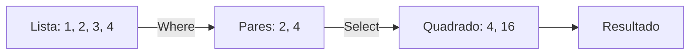

# Aula 12 - Ecossistema C# e .NET 🔷

---

## Agenda 📅

1.  O Que é .NET? <!-- .element: class="fragment" -->
2.  Ferramentas (VS vs VS Code) <!-- .element: class="fragment" -->
3.  C# Básico <!-- .element: class="fragment" -->
4.  LINQ (A Mágica) <!-- .element: class="fragment" -->
5.  F# (O Lado Funcional) <!-- .element: class="fragment" -->

---

## 1. O Que é .NET? 🏗️

- **C#**: A Linguagem. <!-- .element: class="fragment" -->
- **.NET**: A Plataforma (Runtime, Bibliotecas). <!-- .element: class="fragment" -->
- Criado pela Microsoft para bater de frente com o Java. <!-- .element: class="fragment" -->
- Hoje é **Open Source** e roda no Linux/Mac. <!-- .element: class="fragment" -->

---

## 2. Ferramentas 🛠️

Onde programar?

- **Visual Studio (Roxo)**: A IDE completa. Pesada. Faz tudo (Arrastar botões, Banco de Dados). <!-- .element: class="fragment" -->
- **VS Code (Azul)**: Editor leve. Rápido. Exige instalar extensões. <!-- .element: class="fragment" -->

---

### Criando um Projeto 💻

No terminal:

1.  `dotnet new console -o MeuApp` <!-- .element: class="fragment" -->
2.  `cd MeuApp` <!-- .element: class="fragment" -->
3.  `code .` <!-- .element: class="fragment" -->
4.  `dotnet run` <!-- .element: class="fragment" -->

---

## 3. C# Básico 📝

Muito parecido com Java.

```csharp
using System;

class Program {
    static void Main() {
        Console.WriteLine("Olá, C#!");
        // Em Java seria System.out.println
    }
}
```

---

## 4. LINQ: A Joia da Coroa 💎

**L**anguage **In**tegrated **Q**uery.

- Tratar listas como se fossem SQL. <!-- .element: class="fragment" -->
- Filtrar, Ordenar, Transformar dados em **uma linha**. <!-- .element: class="fragment" -->

---

### Sem LINQ (Jeito Velho) 👴

```csharp
List<int> pares = new List<int>();
foreach (int n in numeros) {
    if (n % 2 == 0) {
        pares.Add(n);
    }
}
```

---

### Com LINQ (Jeito Novo) ✨

```csharp
var pares = numeros.Where(n => n % 2 == 0).ToList();
```

> Muito mais limpo e legível!

---

### Visualizando LINQ (Mermaid)



---

## Tipos de Dados Poderosos 💪

- **var**: O compilador adivinha o tipo. <!-- .element: class="fragment" -->
    - `var x = 10;` (Vira int). <!-- .element: class="fragment" -->
- **Nullable Types**: <!-- .element: class="fragment" -->
    - `int? idade = null;` (Pode ser nulo). <!-- .element: class="fragment" -->
    - Evita erros de memória. <!-- .element: class="fragment" -->

---

## 5. F# (Bônus) 🟣

- Linguagem **Funcional** do .NET. <!-- .element: class="fragment" -->
- Focada em Matemática e Dados. <!-- .element: class="fragment" -->
- Influenciou o LINQ e as Lambdas do C#. <!-- .element: class="fragment" -->
- Código muito conciso. <!-- .element: class="fragment" -->

---

## Exercício Rápido ⚡

**LINQ na Prática**

Dada uma lista de preços: `[10.5, 20.0, 5.0, 100.0]`

1.  Filtre os preços maiores que 15.0. <!-- .element: class="fragment" -->
2.  Ordene do maior para o menor. <!-- .element: class="fragment" -->
3.  Mostre o resultado. <!-- .element: class="fragment" -->

---

## Resumo ✅

- C# é moderno, forte e produtivo. <!-- .element: class="fragment" -->
- **.NET** roda em tudo. <!-- .element: class="fragment" -->
- **LINQ** salva vidas (e linhas de código). <!-- .element: class="fragment" -->
- Visual Studio é a casa do C#. <!-- .element: class="fragment" -->

---

## Próxima Aula 🚀

- Vamos sair das linguagens compiladas. <!-- .element: class="fragment" -->
- Vamos para a linguagem mais popular da Ciência de Dados. <!-- .element: class="fragment" -->
- **Python**: Simples, poderoso e lento (mas ninguém liga). <!-- .element: class="fragment" -->

👉 **Tarefa**: Instalar o .NET SDK!