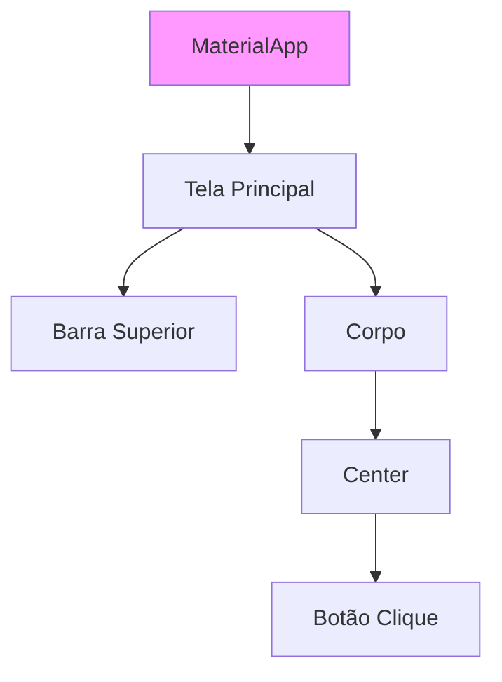
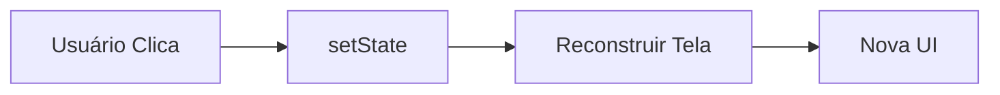

# Aula 15 - Desenvolvimento Mobile 📱

---

## Agenda 📅

1.  O Ecossistema Mobile <!-- .element: class="fragment" -->
2.  Nativo vs Multiplataforma <!-- .element: class="fragment" -->
3.  Dart e Flutter (Google) <!-- .element: class="fragment" -->
4.  Árvore de Widgets <!-- .element: class="fragment" -->
5.  Kotlin (Android Nativo) <!-- .element: class="fragment" -->

---

## 1. O Mundo Mobile 🌍

Dois gigantes dominam o mercado.

- **Android (Google)**: ~70% do mercado mundial. Aberto. Baseado em Linux/Java. <!-- .element: class="fragment" -->
- **iOS (Apple)**: ~29% do mercado. Fechado. Hardware Premium. <!-- .element: class="fragment" -->

---

## 2. Abordagens de Desenvolvimento 🛠️

Como criar apps para eles?

1.  **Nativo**: <!-- .element: class="fragment" -->
    - Performance Máxima. <!-- .element: class="fragment" -->
    - Acesso total ao hardware (GPS, Bluetooth). <!-- .element: class="fragment" -->
    - **Problema**: Precisa fazer 2 vezes (Kotlin para Android, Swift para iOS). <!-- .element: class="fragment" -->

2.  **Multiplataforma**: <!-- .element: class="fragment" -->
    - Escreve uma vez, roda nos dois. <!-- .element: class="fragment" -->
    - Flutter (Dart) ou React Native (JS). <!-- .element: class="fragment" -->
    - **Vantagem**: Velocidade de entrega. <!-- .element: class="fragment" -->

---

## 3. Flutter e Dart 💙

- **Dart**: A linguagem (parece Java + JS). <!-- .element: class="fragment" -->
- **Flutter**: O Kit de Ferramentas (UI Toolkit). <!-- .element: class="fragment" -->
- Renderiza pixels direto na tela (como um jogo). <!-- .element: class="fragment" -->

---

### Tudo é um Widget 🧱

Botão é widget. Texto é widget. Layout é widget.



---

### Código Flutter Básico

```dart
import 'package:flutter/material.dart';

void main() {
  runApp(MaterialApp(
    home: Scaffold(
      appBar: AppBar(title: Text("Meu App")),
      body: Center(child: Text("Olá Mundo!")),
    ),
  ));
}
```

---

## 4. O Estado (State) ⚡

Apps são interativos.
Se o usuário clica, a tela muda.

- **StatelessWidget**: Estático (Ícone, Texto). <!-- .element: class="fragment" -->
- **StatefulWidget**: Dinâmico (Checkbox, Contador). <!-- .element: class="fragment" -->

---

### Ciclo de Vida do Estado



---

## 5. Kotlin (Android Nativo) 🤖

Para quando você precisa de poder bruto.

- Oficial do Google. <!-- .element: class="fragment" -->
- 100% Compatível com Java. <!-- .element: class="fragment" -->
- Conciso e seguro (sem NullPointerException). <!-- .element: class="fragment" -->

```kotlin
fun main() {
    val nome = "Android"
    println("Olá, $nome!")
}
```

---

## Termynal: Criando App 📱

<div data-termynal class="termy">
    <span data-ty="input">flutter create meu_app</span>
    <span data-ty="progress">Criando arquivos...</span>
    <span data-ty="input">flutter run</span>
    <span data-ty="progress">Compilando APK...</span>
    <span data-ty>App rodando no Emulador!</span>
</div>

---

## Resumo ✅

- **Nativo**: Melhor performance, mais trabalho. <!-- .element: class="fragment" -->
- **Multiplataforma**: Menor custo, velocidade. <!-- .element: class="fragment" -->
- **Flutter**: Desenha a tela do zero. <!-- .element: class="fragment" -->
- **Widgets**: Blocos de construção. <!-- .element: class="fragment" -->

---

## Próxima Aula 🚀

- Sair do Cliente (Celular). <!-- .element: class="fragment" -->
- Voltar para o Servidor (Backend). <!-- .element: class="fragment" -->
- A tecnologia que roda 77% da Web. <!-- .element: class="fragment" -->
- **PHP e Arquitetura MVC**. <!-- .element: class="fragment" -->

👉 **Tarefa**: Rodar o "Counter App" do Flutter!